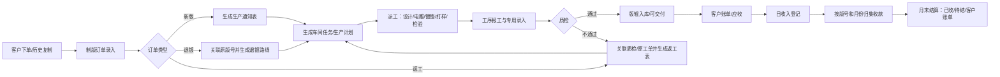
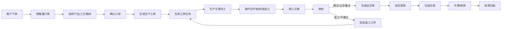
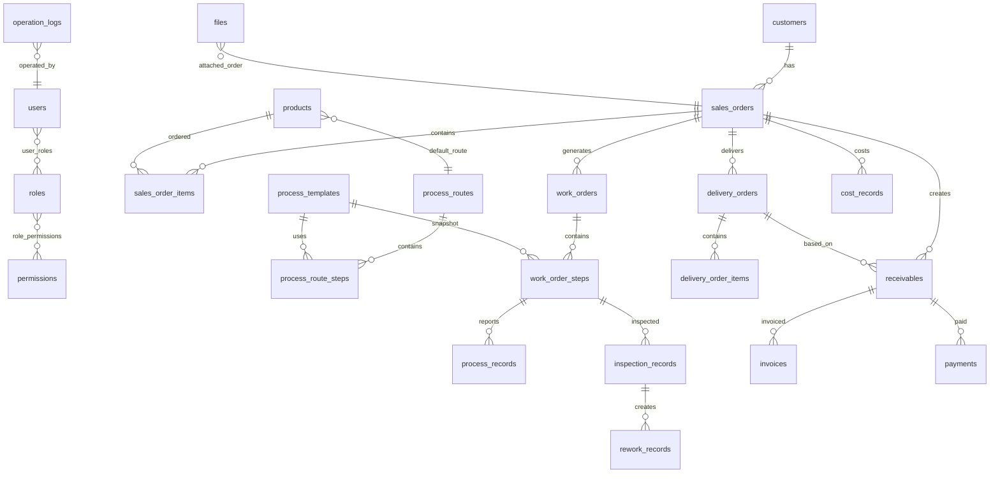
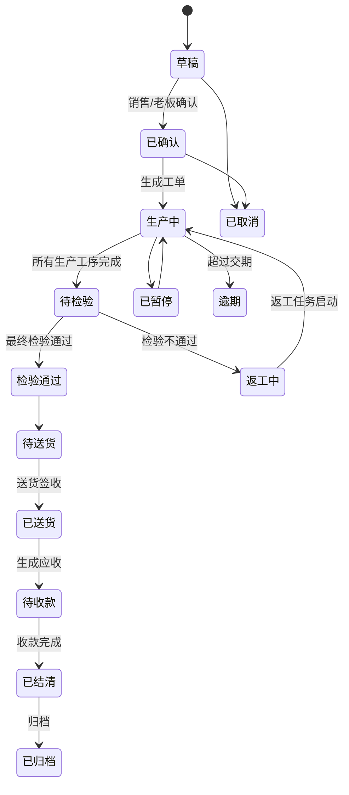
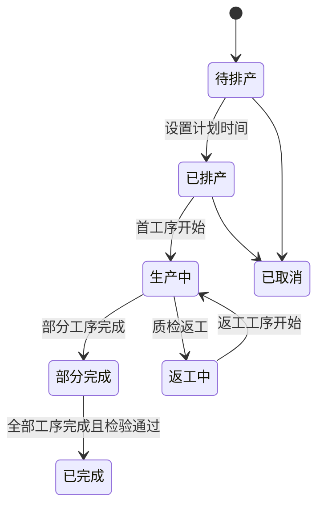
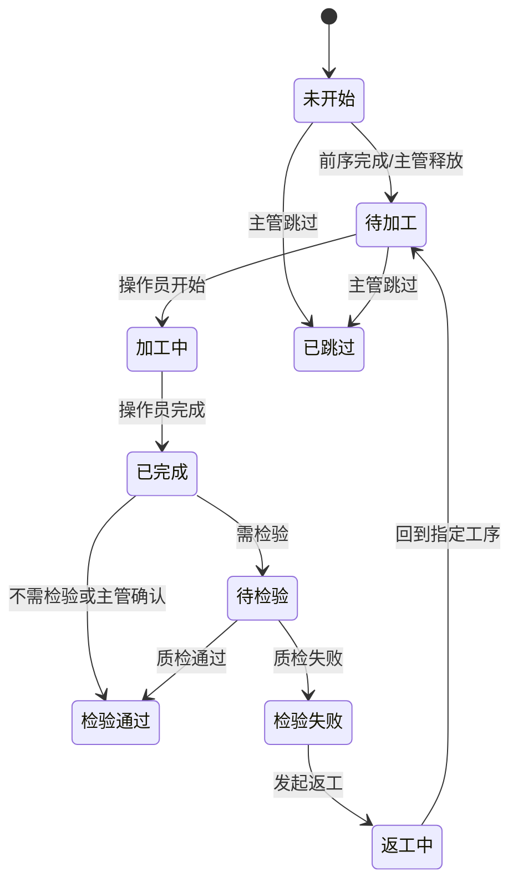
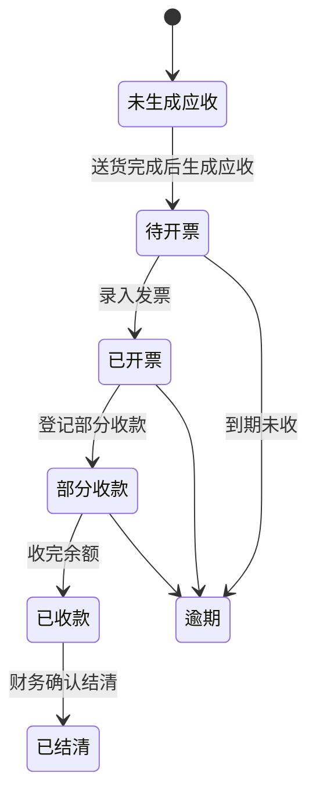

# 加工制造企业 ERP 系统 PRD 与技术设计

版本：v1.2  
日期：2026-06-01  
默认技术栈：Vue 3 + TypeScript + Element Plus + FastAPI + PostgreSQL + JWT/RBAC + Docker Compose

---

## 0. 文档目标

本系统不是简单的订单台账，而是围绕“客户订单 -> 工艺路线 -> 生产工单 -> 工序流转 -> 派工报工 -> 质检返工 -> 送货签收 -> 财务结算 -> 归档统计”的制造闭环管理系统。

核心设计原则：

1. 工艺路线可配置，不把生产过程写死在代码中。
2. 每个订单、工单、工序都有明确状态机。
3. 工序任务按顺序流转，异常调整必须留痕。
4. 报工、质检、返工、送货、财务都与订单闭环关联。
5. RBAC 控制菜单、按钮、数据范围和关键操作。
6. 所有关键业务动作写入操作日志。
7. 先实现制版厂核心闭环，再扩展扫码、移动端、小程序和外部财务软件。

## 0.1 2026-05-29 制版厂功能细则修订

本次修订以现有老系统截图为参照，将系统从“通用加工制造 ERP”调整为更贴近 Bangla Shanghai Plate Making Ltd. 业务的“制版厂 ERP”。系统仍保留现代化交互和权限设计，但功能口径优先对齐现场正在使用的下单、制版、派工、收款、客户账单、库存和打印单据。

### 0.1.0 2026-06-01 追加实现口径

1. 可打印单据必须统一写入打印记录，记录打印号、单据类型、目标单据、操作者、打印时间、数据快照和 HTML 快照，方便补打、核对和追责。
2. 日收入表、版号月结、客户账单必须支持按当前筛选条件导出 Excel。
3. 生产通知表、车间任务单、收据、客户账单的打印模板先以 HTML 打印为主，后续可替换为 PDF 渲染，但接口口径和打印留痕保持不变。

### 0.1.1 截图对应功能清单

| 截图/旧系统功能 | 新系统模块 | 保留重点 | 优化方向 |
|---|---|---|---|
| 下单录入 | 制版订单 | 客户、产品名、版号、C/L/D、数量、色序、印刷方式、材料、交期、业务员、备注 | 分成“订单主信息 + 版辊明细 + 色组明细”，支持历史订单复制 |
| 自动生产通知表 PDF | 打印中心/生产通知 | Bangla Platemaking Production Order 格式、红色关键参数、色序表 | 由订单一键生成，可预览、打印、归档版本 |
| 车间任务单 PDF | 生产计划 | Daily production plan of workshop，按日期、版号、客户、C/L、新旧支数、生产位置汇总 | 支持日期区间、工序/车间筛选、导出 PDF/Excel |
| 退镀下单 | 退镀订单 | 原版号、新版号、客户、规格、数量、镀铬/打样要求 | 作为订单类型 `dechrome`，与原版号关联并进入返修/退镀路线 |
| 返工表 | 返工管理 | 质检来源、返工原因、返工数量、目标工序 | 返工可生成独立返工订单，也可回流原工单 |
| 电雕录入 | 电雕工序 | 颜色、色序、曲线、网线、角度、文件保存、深浅/通透/高光、制版人员、备注 | 作为电雕工序的专用报工表，支持每色录入 |
| 下单指派 PDF | 指派/合格证 | 公司、客户、产品、版号、QC、尺寸、SI No.、日期 | 支持小票式打印，可绑定订单或版号 |
| 收据 PDF | 财务收款 | Money Receipt、客户、月份描述、流水号、日期、付款方式、收到金额 | 从日收入或月结收款生成，不允许手工改总额 |
| 日收入表 | 财务日收入 | 日期、收据号、客户、摘要、现金、银行、其他收入、业务员、收款人、审核时间 | 可审核、反审核、打印收据、导出 Excel |
| 流水表/客户账单 | 客户对账 | 按客户和勾选版号生成 Invoice/Bill，显示上期余额、已付、应收、合计 | 支持按版号勾选、按月份汇总、打印客户账单 |
| 销售月成绩 | 销售报表 | 业务员、新版支数、旧版支数、总金额 | 支持统计全部/只统计返工/不统计返工 |
| 客户月销售额 | 销售报表 | 业务员、客户、新旧支数、金额、单价、结算方式 | 支持按时间段或按天查看 |
| 入库表 | 库存管理 | 供应商、品名、规格、单位、单价、数量、金额、仓库、入库人 | 统一进入库存流水，支持审核入库 |
| 入库单 | 库存单据 | Bill of entry，供应商、经手人、仓库、明细、交货日期 | 可打印、导出、撤销审核 |
| 领料单 | 库存单据 | Material requisition，领料部门、领料人、出库仓库、明细 | 出库后扣减库存，支持撤销出库 |
| 版辊入库单 | 版辊库存 | 版号、直径、版长、版孔、面积、单价、支数、金额、入库状态 | 版号成为生产、收款、账单、库存的统一追踪键 |
| 客户来料 | 客户材料库存 | 客户材料存在公司仓库，挂在客户 ID 下 | 下单时优先提示并调用客户已存来料，消耗留痕 |

### 0.1.2 新系统主流程

制版厂实际主流程调整为：



### 0.1.3 制版订单录入细则

制版订单必须支持三层数据：

1. 订单主信息：订单号、订单类型、新版/旧版/退镀/返工、客户、产品名、原版号、样品号、下单日期、交期、业务员、登记人、审核人、结算方式、加急/特急标记、公共备注。
2. 版辊参数：版号、C、L、直径 Dia、实际直径 Real Dia、版长、版孔、法兰 Flange、斜坡 Slope、键槽 Keyway、动平衡、铜厚、镀层厚度、材料型号、版型、印刷方式、版辊结构、生产位置。
3. 色组明细：颜色序号、颜色名、每色数量、直径、实际直径、公用版号、印刷方式、客户色序、备注。色序列默认支持 -2、-1、0、1 到 12，可按订单扩展。

订单类型建议：

| 类型 | 说明 | 关键规则 |
|---|---|---|
| new_cylinder | 新版制版 | 自动生成新版版号和生产通知表 |
| old_cylinder | 旧版/补版 | 必须关联历史版号或手工填写原版号 |
| dechrome | 退镀 | 必须填写原版号、退镀原因、退镀/镀铬要求 |
| rework | 返工 | 必须关联质检记录、原工单或原版号 |
| electro_engraving | 电雕录入 | 可由订单进入电雕工序，也可对已有版号补录电雕参数 |

下单体验要求：

1. 客户选择后带出账期、业务员、常用材料、客户已存来料。
2. 产品名可从历史订单复制，复制时带出版辊参数和色组明细，但新订单号、下单日期、交期重新生成。
3. 保存草稿不占用正式生产单号；提交/审核后生成正式订单号和版号。
4. 订单审核后才允许生成生产通知表、车间任务单和工单。
5. 关键字段变更必须留痕：客户、版号、C/L/D、数量、金额、交期、订单类型。

### 0.1.4 生产与工序细则

生产不再只使用通用工序页，还需要为制版关键工序提供专用录入：

| 工序 | 页面/表单 | 关键字段 |
|---|---|---|
| 设计/接稿 | 下单指派/接稿 | 设计员、Design Factor1/2、文件、打样要求、镀铬要求 |
| 电雕 | 电雕录入 | 色序、颜色、Color Cylinder No.、Curve、Grid Line、Screen Angle、Stitch、File Save、Shade/Thorough/Highlight、Makeup Man |
| 镀铬/退镀 | 镀铬/退镀工序 | 镀铬要求、退镀原因、铜厚、铬厚、是否返工 |
| 打样 | 打样记录 | 打样时间、结果、样张/图片、客户确认状态 |
| 检验/QC | 合格证/质检 | QC 人员、SI No.、合格/返工、缺陷原因、检验备注 |
| 版辊入库 | 版辊入库单 | 版号、直径、版长、版孔、面积、单价、支数、入库仓库、入库状态 |

车间任务单必须支持：

1. 按日期区间生成 Daily production plan of workshop。
2. 列出版号、客户、C、L、新版支数、旧版支数、生产位置、备注。
3. 自动汇总 QTY 和 Square。
4. 支持按工序、生产位置、业务员、加急状态筛选。

### 0.1.5 单据打印细则

系统需要建立统一打印中心，所有打印均来自数据库快照，不允许打印后数据被静默覆盖。

| 单据 | 触发来源 | 输出 |
|---|---|---|
| 制版生产通知表 | 订单审核后 | PDF/浏览器打印，版号、客户、产品、C/L/D、色序、数量、关键参数红色突出 |
| 车间任务单 | 生产计划 | PDF/Excel，按日期区间和生产位置汇总 |
| 下单指派/合格证 | 订单或 QC 通过 | 小票式 PDF，客户、产品、版号、尺寸、QC、SI No. |
| Money Receipt | 日收入/收款记录 | PDF，客户、月份摘要、流水号、方式、收到金额、大写金额 |
| Invoice/Bill | 客户账单 | PDF，客户、勾选版号、产品、尺寸、单价、金额、上期余额、已付、合计应收 |
| 入库单 Bill of entry | 库存入库 | PDF/Excel，供应商、仓库、经手人、明细、交货日期 |
| 领料单 Material requisition | 库存出库 | PDF/Excel，领料部门、领料人、仓库、明细 |
| 版辊入库单 | 版辊入库 | PDF/Excel，版号、版长、版孔、面积、单价、支数、金额 |

打印规则：

1. 每次打印生成 `print_jobs` 记录：单据类型、业务对象、打印人、打印时间、模板版本。
2. 财务类单据打印必须从已审核数据生成；草稿只能预览并显示水印。
3. 客户账单支持“按客户 + 勾选版号 + 月份”生成，生成后可锁定账单快照。

### 0.1.6 财务收款与月结细则

收款模型从“单笔应收直接扣款”调整为“日收入登记 + 版号/月度归集 + 客户账单结算”。

核心规则：

1. 每笔实际收到的钱先进入日收入表，记录日期、客户、版号或多个版号、收款方式、现金/银行/其他收入、业务员、收款人、审核状态。
2. 同一客户、同一版号、同一自然月内可以多次收款；月末统一归集为一条月度收款汇总。
3. 月度汇总键为：`customer_id + cylinder_no + accounting_month`。例如 2026-05-01 到 2026-05-31 期间，同一订单/版号陆续收到 1000、1000、2000，月末显示为 `26/5 共收 4000`。
4. 选择版号时必须能看到该版号每个月的应收、已收、待结款、收款明细和对应收据。
5. 客户账单可以按客户名和勾选版号生成；只统计被勾选版号的应收、已收、待结。
6. 收据可以从日收入表打印，也可以从月度汇总打印；从月度汇总打印时描述默认显示月份，例如 `May 2026` 或 `26/5`。
7. 财务记录不允许物理删除，只允许审核、反审核、冲正。反审核必须记录原因和操作人。

建议新增概念：

| 概念 | 用途 | 关键字段 |
|---|---|---|
| receipt_daily_entries | 日收入流水 | receipt_no、customer_id、received_date、payment_method、cash_amount、bank_amount、other_amount、salesman_id、payee、checked_at |
| receipt_allocations | 收款分摊 | daily_entry_id、cylinder_no、sales_order_id、amount、accounting_month |
| monthly_payment_summaries | 月度收款汇总 | customer_id、cylinder_no、accounting_month、received_amount、receivable_amount、due_amount、closed_status |
| customer_statement_runs | 客户账单快照 | customer_id、month、selected_cylinder_nos、previous_balance、current_receivable、received、due、printed_at |

金额计算：

```text
版号月度应收 = 当月该版号已审核账单/订单金额
版号月度已收 = 当月该版号所有已审核 receipt_allocations 金额之和
版号月度待结 = 上期待结 + 当月应收 - 当月已收 + 调增 - 调减
客户总待结 = 客户所有版号待结之和
```

### 0.1.7 库存、客户来料与版辊库存细则

库存从后续扩展提前进入核心范围，至少覆盖材料入库、领料、版辊入库和客户来料。

库存类型：

| 类型 | 归属 | 说明 |
|---|---|---|
| company_material | 公司材料 | 公司购买，按供应商、仓库、品名、规格管理 |
| customer_material | 客户来料 | 客户材料存放在公司仓库，必须挂在客户 ID 下 |
| cylinder_stock | 版辊库存 | 完成或入库的版辊，按版号管理 |
| auxiliary_material | 辅料 | 胶带、酒精、开关、手套等低值耗材 |

客户来料规则：

1. 客户材料入库时必须选择客户，库存所有权为客户。
2. 新建订单选择客户后，系统提示该客户名下可用来料。
3. 若客户有已存来料，订单材料选择中优先显示客户来料，并标识“客户库存”。
4. 调用客户来料时生成材料占用记录；工单开工或领料审核后正式扣减。
5. 客户来料不可被其他客户订单直接使用；管理员调拨必须记录原因。

入库/领料规则：

1. 入库单审核后增加库存，反审核/撤销入库生成反向库存流水。
2. 领料单审核后扣减库存，库存不足时禁止审核或要求管理员强制审批。
3. 领料可关联订单、工单、工序或部门。
4. 库存流水必须能按品名、规格、供应商、客户、仓库、日期查询。

### 0.1.8 报表与看板细则

必须覆盖以下报表：

| 报表 | 统计口径 |
|---|---|
| 日收入表 | 按日期区间统计现金、银行、其他收入、合计，可审核、打印收据 |
| 流水表 | 财务流水明细，支持客户、版号、收据号、业务员、收款方式查询 |
| 对账汇总表 | 按客户显示上期应收、本期应收、总应收、已收、调增、调减、待结 |
| 销售月成绩 | 按业务员统计新版支数、旧版支数、总金额，支持包含/排除返工 |
| 客户月销售额 | 按业务员 + 客户统计新旧支数、金额、单价、结算方式 |
| 生产计划表 | 按日期、工序、生产位置统计待生产版号和数量 |
| 库存入库表 | 按供应商、品名、规格、仓库、日期统计入库数量和金额 |
| 领料表 | 按部门、领料人、品名、仓库、日期统计出库数量和金额 |
| 版辊入库表 | 按版号、客户、直径、版长、面积、状态统计版辊入库 |

### 0.1.9 MVP 范围调整

MVP 必须优先交付以下能力：

1. 制版订单录入：新版、旧版、退镀、返工，支持版号和色组明细。
2. 生产通知表、车间任务单、收据、客户账单四类核心打印。
3. 生产工序中至少支持派工、电雕录入、质检返工、版辊入库。
4. 财务支持日收入登记、收据打印、按版号/月度汇总收款、查看待结款。
5. 客户账单支持按客户和勾选版号生成。
6. 库存支持材料入库、领料、客户来料、版辊入库。
7. 销售月成绩、客户月销售额、日收入表、对账汇总表可查询和导出。

---

# 第一阶段：业务流程梳理

## 1.1 主业务闭环

标准流程：



## 1.2 默认工艺路线

路线 A：机械加工 -> 卷板 -> 车床 -> 磨床 -> 镀铜 -> 研磨 -> 雕刻 -> 镀铬 -> 打样 -> 检验  
路线 B：看样/设计 -> 排版 -> 拼板 -> 雕刻 -> 镀铬 -> 打样 -> 检验

系统必须支持：

1. 新增、删除、禁用工序模板。
2. 新增、复制、调整工艺路线。
3. 对订单临时调整路线步骤。
4. 某些工序可跳过，但必须记录原因。
5. 临时新增工序，但必须保存到工单步骤快照中。
6. 返工可回到任意指定工序。

## 1.3 异常业务流程

订单暂停：

1. 老板/管理员/生产主管可暂停订单或工单。
2. 暂停后所有未开始工序不可启动。
3. 已加工中工序可由主管决定继续完成或强制暂停。

订单取消：

1. 草稿订单可由销售删除或取消。
2. 已确认订单只能由管理员/老板取消。
3. 已生成工单后取消需记录原因，并禁止直接物理删除。

质检不通过：

1. 质检员选择“不通过”或“返工”。
2. 必须填写原因、缺陷描述、照片。
3. 必须选择返工回到哪个工序。
4. 系统生成 rework_records。
5. 被返工工序及其后续工序进入返工/待加工状态。

财务冲正：

1. 报工、成本、收款、发票记录不允许普通删除。
2. 管理员可冲正，系统新增一条反向记录。
3. 原记录保留，操作日志保留。

---

# 第二阶段：系统模块划分

## 2.1 模块总览

| 模块 | 核心职责 | 主要角色 |
|---|---|---|
| 客户管理 | 客户档案、联系人、账期、历史订单、应收汇总 | 销售、财务、老板 |
| 产品管理 | 产品档案、规格、默认路线、价格参考 | 销售、生产主管、管理员 |
| 版号/版辊档案 | 版号、客户、产品、C/L/D、色组、历史生产、收款和库存状态 | 销售、生产主管、财务、仓库 |
| 制版订单管理 | 新版、旧版、退镀、返工、电雕订单录入，确认、附件、交期、金额 | 销售、老板、生产主管 |
| 看样/设计 | 样品图、设计文件、排版、拼板、版本审核 | 设计、销售、生产主管 |
| 电雕录入 | 每色电雕参数、曲线、网线、角度、文件保存、深浅/通透/高光 | 电雕人员、生产主管 |
| 工序模板 | 维护基础工序、工序类型、是否需检验 | 管理员、生产主管 |
| 工艺路线 | 维护路线、步骤顺序、跳过规则、默认路线 | 管理员、生产主管 |
| 生产工单 | 工单拆分、排产、加急、暂停、取消、返工 | 生产主管 |
| 工序流转 | 按步骤流转、异常记录、当前卡点 | 生产主管、操作员 |
| 派工报工 | 分配操作员、开始、完成、数量、工时、照片 | 生产主管、操作员 |
| 质检管理 | 检验、让步通过、不通过、返工、报告导出 | 质检员 |
| 打印中心 | 生产通知表、车间任务单、合格证、收据、客户账单、库存单据打印 | 各业务角色按权限 |
| 送货管理 | 送货单、签收、司机物流、打印 | 仓库/送货 |
| 财务结算 | 应收、日收入、收据、按版号和月份汇总收款、待结款、客户账单 | 财务 |
| 成本统计 | 人工、材料、外协、加工费用、订单毛利 | 财务、老板 |
| 库存管理 | 材料入库、领料、客户来料、版辊入库、库存流水 | 仓库、财务、生产主管 |
| 看板报表 | 进度、队列、逾期、不良率、效率、利润 | 各角色按权限 |
| 权限管理 | 用户、角色、权限、菜单、按钮 | 管理员 |
| 基础资料 | 字典、编号规则、公司信息、文件配置 | 管理员 |

## 2.2 角色权限设计

| 角色 | 可见菜单 | 主要权限 | 禁止/限制 |
|---|---|---|---|
| 老板/管理员 | 全部 | 系统配置、权限、全部数据查看、关键审批、冲正、导出 | 无业务限制，但所有关键操作留痕 |
| 销售/跟单 | 客户、订单、进度、送货状态、应收只读 | 建客户、建订单、上传附件、跟进订单、查看进度 | 不可修改工序、报工、财务实收 |
| 设计人员 | 看样/设计、我的设计任务、订单附件只读 | 上传设计/排版/拼板文件、版本提交 | 不可确认订单、不可派工 |
| 生产主管 | 工单、工艺路线、派工、看板、返工 | 生成工单、拆单、派工、调整流转、暂停/加急 | 不可修改收款、发票 |
| 各工序操作员 | 我的任务、报工 | 开始加工、完成加工、填写报工、上传现场照片 | 只能看分配给自己的工序 |
| 质检员 | 质检、返工、质检报表 | 提交检验、生成返工、导出质检报告 | 不可修改订单金额和财务 |
| 仓库/送货人员 | 库存、领料、版辊入库、送货、待送货订单 | 入库审核、领料出库、版辊入库、生成送货单、打印、登记签收 | 只有检验通过数据可送货；客户来料不可跨客户使用 |
| 财务人员 | 应收、日收入、收据、月结、客户账单、成本、利润报表 | 生成应收、收款登记、月度汇总、收据打印、客户账单、账期提醒、成本维护 | 不可修改工序流转；反审核和冲正需留痕 |

## 2.3 RBAC 权限粒度

权限分为四层：

1. 菜单权限：是否显示某菜单。
2. 页面权限：是否进入页面。
3. 操作权限：新增、编辑、删除、确认、导出、冲正、审批。
4. 数据权限：本人、部门、全部、按客户、按工序。

示例权限编码：

| 编码 | 说明 |
|---|---|
| customer:view | 查看客户 |
| customer:create | 新建客户 |
| order:confirm | 确认订单 |
| work_order:create | 生成工单 |
| work_order:dispatch | 派工 |
| step:start | 开始工序 |
| step:complete | 完成工序 |
| inspection:submit | 提交质检 |
| rework:create | 发起返工 |
| delivery:create | 生成送货单 |
| finance:receivable:create | 生成应收 |
| finance:payment:create | 收款登记 |
| finance:receipt:print | 打印收据 |
| finance:month_close | 月度收款汇总 |
| finance:adjust | 财务冲正 |
| inventory:receive | 库存入库 |
| inventory:issue | 领料出库 |
| cylinder:stock_in | 版辊入库 |
| report:export | 导出报表 |
| system:permission | 权限管理 |

---

# 第三阶段：数据库 ERD 设计

## 3.1 ERD 总览



## 3.2 通用字段约定

除特殊说明外，业务表建议包含：

| 字段 | 类型 | 必填 | 说明 |
|---|---|---|---|
| id | uuid | 是 | 主键 |
| created_at | timestamptz | 是 | 创建时间 |
| updated_at | timestamptz | 是 | 更新时间 |
| created_by | uuid | 否 | 创建人 |
| updated_by | uuid | 否 | 更新人 |
| deleted_at | timestamptz | 否 | 软删除时间 |

## 3.3 表结构

### 1. users 用户表

| 字段名 | 类型 | 主键 | 外键 | 必填 | 说明 |
|---|---|---|---|---|---|
| id | uuid | 是 | 否 | 是 | 用户 ID |
| username | varchar(64) | 否 | 否 | 是 | 登录名，唯一 |
| password_hash | varchar(255) | 否 | 否 | 是 | 密码哈希 |
| real_name | varchar(64) | 否 | 否 | 是 | 姓名 |
| phone | varchar(32) | 否 | 否 | 否 | 手机 |
| email | varchar(128) | 否 | 否 | 否 | 邮箱 |
| department | varchar(64) | 否 | 否 | 否 | 部门 |
| status | varchar(20) | 否 | 否 | 是 | active/disabled |
| last_login_at | timestamptz | 否 | 否 | 否 | 最近登录 |

补充关联表 user_roles：

| 字段名 | 类型 | 主键 | 外键 | 必填 | 说明 |
|---|---|---|---|---|---|
| user_id | uuid | 是 | users.id | 是 | 用户 |
| role_id | uuid | 是 | roles.id | 是 | 角色 |

### 2. roles 角色表

| 字段名 | 类型 | 主键 | 外键 | 必填 | 说明 |
|---|---|---|---|---|---|
| id | uuid | 是 | 否 | 是 | 角色 ID |
| code | varchar(64) | 否 | 否 | 是 | 角色编码 |
| name | varchar(64) | 否 | 否 | 是 | 角色名称 |
| description | text | 否 | 否 | 否 | 描述 |
| status | varchar(20) | 否 | 否 | 是 | active/disabled |

### 3. permissions 权限表

| 字段名 | 类型 | 主键 | 外键 | 必填 | 说明 |
|---|---|---|---|---|---|
| id | uuid | 是 | 否 | 是 | 权限 ID |
| code | varchar(128) | 否 | 否 | 是 | 权限编码 |
| name | varchar(128) | 否 | 否 | 是 | 权限名称 |
| type | varchar(20) | 否 | 否 | 是 | menu/page/action/data |
| parent_id | uuid | 否 | permissions.id | 否 | 父权限 |
| sort_no | int | 否 | 否 | 是 | 排序 |

补充关联表 role_permissions：

| 字段名 | 类型 | 主键 | 外键 | 必填 | 说明 |
|---|---|---|---|---|---|
| role_id | uuid | 是 | roles.id | 是 | 角色 |
| permission_id | uuid | 是 | permissions.id | 是 | 权限 |

### 4. customers 客户表

| 字段名 | 类型 | 主键 | 外键 | 必填 | 说明 |
|---|---|---|---|---|---|
| id | uuid | 是 | 否 | 是 | 客户 ID |
| customer_code | varchar(64) | 否 | 否 | 是 | 客户编号 |
| name | varchar(128) | 否 | 否 | 是 | 客户名称 |
| contact_name | varchar(64) | 否 | 否 | 否 | 联系人 |
| phone | varchar(32) | 否 | 否 | 否 | 电话 |
| address | varchar(255) | 否 | 否 | 否 | 地址 |
| payment_terms_days | int | 否 | 否 | 是 | 账期天数 |
| credit_limit | numeric(18,2) | 否 | 否 | 否 | 信用额度 |
| tax_no | varchar(64) | 否 | 否 | 否 | 税号 |
| remark | text | 否 | 否 | 否 | 备注 |
| status | varchar(20) | 否 | 否 | 是 | active/disabled |

历史订单和应收款通过 sales_orders、receivables 关联查询。

### 5. sales_orders 销售订单表

| 字段名 | 类型 | 主键 | 外键 | 必填 | 说明 |
|---|---|---|---|---|---|
| id | uuid | 是 | 否 | 是 | 订单 ID |
| order_no | varchar(64) | 否 | 否 | 是 | 自动生成订单编号 |
| customer_id | uuid | 否 | customers.id | 是 | 客户 |
| product_summary | varchar(255) | 否 | 否 | 是 | 产品摘要 |
| order_date | date | 否 | 否 | 是 | 下单日期 |
| due_date | date | 否 | 否 | 是 | 交期 |
| total_amount | numeric(18,2) | 否 | 否 | 是 | 总金额 |
| status | varchar(32) | 否 | 否 | 是 | 订单状态 |
| priority | varchar(20) | 否 | 否 | 是 | normal/urgent |
| route_id | uuid | 否 | process_routes.id | 否 | 默认选择路线 |
| confirmed_at | timestamptz | 否 | 否 | 否 | 确认时间 |
| confirmed_by | uuid | 否 | users.id | 否 | 确认人 |
| remark | text | 否 | 否 | 否 | 备注 |

### 6. sales_order_items 订单明细表

| 字段名 | 类型 | 主键 | 外键 | 必填 | 说明 |
|---|---|---|---|---|---|
| id | uuid | 是 | 否 | 是 | 明细 ID |
| sales_order_id | uuid | 否 | sales_orders.id | 是 | 订单 |
| product_id | uuid | 否 | products.id | 否 | 产品 |
| product_name | varchar(128) | 否 | 否 | 是 | 产品名称快照 |
| specification | varchar(255) | 否 | 否 | 否 | 规格 |
| quantity | numeric(18,3) | 否 | 否 | 是 | 数量 |
| unit | varchar(20) | 否 | 否 | 是 | 单位 |
| unit_price | numeric(18,2) | 否 | 否 | 是 | 单价 |
| amount | numeric(18,2) | 否 | 否 | 是 | 金额 |
| route_id | uuid | 否 | process_routes.id | 否 | 明细路线 |
| remark | text | 否 | 否 | 否 | 备注 |

### 7. products 产品表

| 字段名 | 类型 | 主键 | 外键 | 必填 | 说明 |
|---|---|---|---|---|---|
| id | uuid | 是 | 否 | 是 | 产品 ID |
| product_code | varchar(64) | 否 | 否 | 是 | 产品编号 |
| name | varchar(128) | 否 | 否 | 是 | 产品名称 |
| specification | varchar(255) | 否 | 否 | 否 | 默认规格 |
| unit | varchar(20) | 否 | 否 | 是 | 单位 |
| default_route_id | uuid | 否 | process_routes.id | 否 | 默认工艺路线 |
| reference_price | numeric(18,2) | 否 | 否 | 否 | 参考价 |
| status | varchar(20) | 否 | 否 | 是 | active/disabled |
| remark | text | 否 | 否 | 否 | 备注 |

### 8. process_templates 工序模板表

| 字段名 | 类型 | 主键 | 外键 | 必填 | 说明 |
|---|---|---|---|---|---|
| id | uuid | 是 | 否 | 是 | 工序模板 ID |
| code | varchar(64) | 否 | 否 | 是 | 工序编码 |
| name | varchar(64) | 否 | 否 | 是 | 工序名称 |
| category | varchar(64) | 否 | 否 | 否 | 加工/设计/检验/外协 |
| requires_inspection | boolean | 否 | 否 | 是 | 是否需要检验 |
| standard_hours | numeric(10,2) | 否 | 否 | 否 | 标准工时 |
| default_cost_rate | numeric(18,2) | 否 | 否 | 否 | 默认工费 |
| enabled | boolean | 否 | 否 | 是 | 是否启用 |

### 9. process_routes 工艺路线表

| 字段名 | 类型 | 主键 | 外键 | 必填 | 说明 |
|---|---|---|---|---|---|
| id | uuid | 是 | 否 | 是 | 路线 ID |
| route_code | varchar(64) | 否 | 否 | 是 | 路线编码 |
| name | varchar(128) | 否 | 否 | 是 | 路线名称 |
| version | int | 否 | 否 | 是 | 版本 |
| description | text | 否 | 否 | 否 | 描述 |
| is_default | boolean | 否 | 否 | 是 | 是否默认 |
| status | varchar(20) | 否 | 否 | 是 | draft/active/disabled |

### 10. process_route_steps 工艺路线步骤表

| 字段名 | 类型 | 主键 | 外键 | 必填 | 说明 |
|---|---|---|---|---|---|
| id | uuid | 是 | 否 | 是 | 步骤 ID |
| route_id | uuid | 否 | process_routes.id | 是 | 路线 |
| process_template_id | uuid | 否 | process_templates.id | 是 | 工序模板 |
| step_no | int | 否 | 否 | 是 | 顺序号 |
| step_name | varchar(64) | 否 | 否 | 是 | 工序名称快照 |
| is_optional | boolean | 否 | 否 | 是 | 是否可跳过 |
| requires_inspection | boolean | 否 | 否 | 是 | 是否需检验 |
| planned_hours | numeric(10,2) | 否 | 否 | 否 | 计划工时 |
| remark | text | 否 | 否 | 否 | 备注 |

### 11. work_orders 生产工单表

| 字段名 | 类型 | 主键 | 外键 | 必填 | 说明 |
|---|---|---|---|---|---|
| id | uuid | 是 | 否 | 是 | 工单 ID |
| work_order_no | varchar(64) | 否 | 否 | 是 | 工单编号 |
| sales_order_id | uuid | 否 | sales_orders.id | 是 | 销售订单 |
| sales_order_item_id | uuid | 否 | sales_order_items.id | 否 | 订单明细 |
| product_id | uuid | 否 | products.id | 否 | 产品 |
| product_name | varchar(128) | 否 | 否 | 是 | 产品快照 |
| quantity | numeric(18,3) | 否 | 否 | 是 | 生产数量 |
| route_id | uuid | 否 | process_routes.id | 是 | 选择路线 |
| status | varchar(32) | 否 | 否 | 是 | 工单状态 |
| priority | varchar(20) | 否 | 否 | 是 | normal/urgent |
| planned_start_at | timestamptz | 否 | 否 | 否 | 计划开始 |
| planned_end_at | timestamptz | 否 | 否 | 否 | 计划完成 |
| actual_start_at | timestamptz | 否 | 否 | 否 | 实际开始 |
| actual_end_at | timestamptz | 否 | 否 | 否 | 实际完成 |
| remark | text | 否 | 否 | 否 | 备注 |

### 12. work_order_steps 工单工序表

| 字段名 | 类型 | 主键 | 外键 | 必填 | 说明 |
|---|---|---|---|---|---|
| id | uuid | 是 | 否 | 是 | 工单工序 ID |
| work_order_id | uuid | 否 | work_orders.id | 是 | 工单 |
| process_template_id | uuid | 否 | process_templates.id | 否 | 来源模板 |
| step_no | int | 否 | 否 | 是 | 顺序 |
| step_name | varchar(64) | 否 | 否 | 是 | 工序名称快照 |
| status | varchar(32) | 否 | 否 | 是 | 工序状态 |
| assigned_user_id | uuid | 否 | users.id | 否 | 操作员 |
| planned_start_at | timestamptz | 否 | 否 | 否 | 计划开始 |
| planned_end_at | timestamptz | 否 | 否 | 否 | 计划完成 |
| actual_start_at | timestamptz | 否 | 否 | 否 | 实际开始 |
| actual_end_at | timestamptz | 否 | 否 | 否 | 实际完成 |
| input_qty | numeric(18,3) | 否 | 否 | 否 | 投入数量 |
| qualified_qty | numeric(18,3) | 否 | 否 | 否 | 合格数量 |
| defective_qty | numeric(18,3) | 否 | 否 | 否 | 不良数量 |
| is_skipped | boolean | 否 | 否 | 是 | 是否跳过 |
| skip_reason | text | 否 | 否 | 否 | 跳过原因 |
| remark | text | 否 | 否 | 否 | 备注 |

### 13. process_records 工序报工记录表

| 字段名 | 类型 | 主键 | 外键 | 必填 | 说明 |
|---|---|---|---|---|---|
| id | uuid | 是 | 否 | 是 | 报工 ID |
| work_order_id | uuid | 否 | work_orders.id | 是 | 工单 |
| work_order_step_id | uuid | 否 | work_order_steps.id | 是 | 工序 |
| operator_id | uuid | 否 | users.id | 是 | 操作员 |
| action | varchar(32) | 否 | 否 | 是 | start/complete/adjust/reverse |
| processed_qty | numeric(18,3) | 否 | 否 | 否 | 加工数量 |
| qualified_qty | numeric(18,3) | 否 | 否 | 否 | 合格数量 |
| defective_qty | numeric(18,3) | 否 | 否 | 否 | 不良数量 |
| work_hours | numeric(10,2) | 否 | 否 | 否 | 工时 |
| reported_at | timestamptz | 否 | 否 | 是 | 报工时间 |
| remark | text | 否 | 否 | 否 | 备注 |
| reversed_record_id | uuid | 否 | process_records.id | 否 | 被冲正记录 |

### 14. inspection_records 质检记录表

| 字段名 | 类型 | 主键 | 外键 | 必填 | 说明 |
|---|---|---|---|---|---|
| id | uuid | 是 | 否 | 是 | 质检 ID |
| inspection_no | varchar(64) | 否 | 否 | 是 | 质检编号 |
| sales_order_id | uuid | 否 | sales_orders.id | 是 | 订单 |
| work_order_id | uuid | 否 | work_orders.id | 是 | 工单 |
| work_order_step_id | uuid | 否 | work_order_steps.id | 是 | 工序 |
| inspector_id | uuid | 否 | users.id | 是 | 质检员 |
| inspection_type | varchar(32) | 否 | 否 | 是 | sample/final/process |
| result | varchar(32) | 否 | 否 | 是 | passed/failed/concession/rework |
| inspected_qty | numeric(18,3) | 否 | 否 | 是 | 检验数量 |
| passed_qty | numeric(18,3) | 否 | 否 | 否 | 通过数量 |
| failed_qty | numeric(18,3) | 否 | 否 | 否 | 不良数量 |
| reason | text | 否 | 否 | 条件必填 | 不通过原因 |
| rework_to_step_id | uuid | 否 | work_order_steps.id | 条件必填 | 返工目标工序 |
| inspected_at | timestamptz | 否 | 否 | 是 | 检验时间 |

### 15. rework_records 返工记录表

| 字段名 | 类型 | 主键 | 外键 | 必填 | 说明 |
|---|---|---|---|---|---|
| id | uuid | 是 | 否 | 是 | 返工 ID |
| rework_no | varchar(64) | 否 | 否 | 是 | 返工编号 |
| inspection_record_id | uuid | 否 | inspection_records.id | 是 | 来源质检 |
| work_order_id | uuid | 否 | work_orders.id | 是 | 工单 |
| from_step_id | uuid | 否 | work_order_steps.id | 是 | 发现问题工序 |
| to_step_id | uuid | 否 | work_order_steps.id | 是 | 返工目标工序 |
| reason | text | 否 | 否 | 是 | 返工原因 |
| quantity | numeric(18,3) | 否 | 否 | 是 | 返工数量 |
| status | varchar(32) | 否 | 否 | 是 | pending/processing/completed/cancelled |
| created_by | uuid | 否 | users.id | 是 | 发起人 |
| completed_at | timestamptz | 否 | 否 | 否 | 完成时间 |

### 16. delivery_orders 送货单表

| 字段名 | 类型 | 主键 | 外键 | 必填 | 说明 |
|---|---|---|---|---|---|
| id | uuid | 是 | 否 | 是 | 送货单 ID |
| delivery_no | varchar(64) | 否 | 否 | 是 | 送货单号 |
| sales_order_id | uuid | 否 | sales_orders.id | 是 | 订单 |
| customer_id | uuid | 否 | customers.id | 是 | 客户 |
| address | varchar(255) | 否 | 否 | 是 | 送货地址 |
| delivery_time | timestamptz | 否 | 否 | 是 | 送货时间 |
| driver_name | varchar(64) | 否 | 否 | 否 | 司机 |
| logistics_no | varchar(128) | 否 | 否 | 否 | 物流单号 |
| status | varchar(32) | 否 | 否 | 是 | draft/shipped/signed/cancelled |
| signed_by | varchar(64) | 否 | 否 | 否 | 签收人 |
| signed_at | timestamptz | 否 | 否 | 否 | 签收时间 |
| remark | text | 否 | 否 | 否 | 备注 |

### 17. delivery_order_items 送货明细表

| 字段名 | 类型 | 主键 | 外键 | 必填 | 说明 |
|---|---|---|---|---|---|
| id | uuid | 是 | 否 | 是 | 明细 ID |
| delivery_order_id | uuid | 否 | delivery_orders.id | 是 | 送货单 |
| sales_order_item_id | uuid | 否 | sales_order_items.id | 否 | 订单明细 |
| product_name | varchar(128) | 否 | 否 | 是 | 产品名称 |
| specification | varchar(255) | 否 | 否 | 否 | 规格 |
| quantity | numeric(18,3) | 否 | 否 | 是 | 送货数量 |
| unit | varchar(20) | 否 | 否 | 是 | 单位 |

### 18. invoices 发票表

| 字段名 | 类型 | 主键 | 外键 | 必填 | 说明 |
|---|---|---|---|---|---|
| id | uuid | 是 | 否 | 是 | 发票 ID |
| invoice_no | varchar(64) | 否 | 否 | 是 | 发票号 |
| receivable_id | uuid | 否 | receivables.id | 是 | 应收 |
| customer_id | uuid | 否 | customers.id | 是 | 客户 |
| invoice_amount | numeric(18,2) | 否 | 否 | 是 | 开票金额 |
| tax_rate | numeric(5,2) | 否 | 否 | 否 | 税率 |
| invoice_date | date | 否 | 否 | 是 | 开票日期 |
| status | varchar(32) | 否 | 否 | 是 | draft/issued/voided |
| remark | text | 否 | 否 | 否 | 备注 |

### 19. receivables 应收账款表

| 字段名 | 类型 | 主键 | 外键 | 必填 | 说明 |
|---|---|---|---|---|---|
| id | uuid | 是 | 否 | 是 | 应收 ID |
| receivable_no | varchar(64) | 否 | 否 | 是 | 应收编号 |
| sales_order_id | uuid | 否 | sales_orders.id | 是 | 订单 |
| delivery_order_id | uuid | 否 | delivery_orders.id | 否 | 送货单 |
| customer_id | uuid | 否 | customers.id | 是 | 客户 |
| amount | numeric(18,2) | 否 | 否 | 是 | 应收金额 |
| received_amount | numeric(18,2) | 否 | 否 | 是 | 已收金额 |
| balance_amount | numeric(18,2) | 否 | 否 | 是 | 未收金额 |
| due_date | date | 否 | 否 | 是 | 到期日 |
| invoice_status | varchar(32) | 否 | 否 | 是 | pending/issued/partial/voided |
| finance_status | varchar(32) | 否 | 否 | 是 | pending_invoice/invoiced/partial_paid/paid/closed/overdue |
| status | varchar(32) | 否 | 否 | 是 | active/closed/cancelled |

### 20. payments 收款记录表

| 字段名 | 类型 | 主键 | 外键 | 必填 | 说明 |
|---|---|---|---|---|---|
| id | uuid | 是 | 否 | 是 | 收款 ID |
| payment_no | varchar(64) | 否 | 否 | 是 | 收款编号 |
| receivable_id | uuid | 否 | receivables.id | 是 | 应收 |
| customer_id | uuid | 否 | customers.id | 是 | 客户 |
| amount | numeric(18,2) | 否 | 否 | 是 | 收款金额 |
| payment_date | date | 否 | 否 | 是 | 收款日期 |
| payment_method | varchar(32) | 否 | 否 | 否 | 现金/银行/微信/支付宝/其他 |
| reference_no | varchar(128) | 否 | 否 | 否 | 流水号 |
| remark | text | 否 | 否 | 否 | 备注 |
| reversed_payment_id | uuid | 否 | payments.id | 否 | 冲正来源 |

### 21. cost_records 成本记录表

| 字段名 | 类型 | 主键 | 外键 | 必填 | 说明 |
|---|---|---|---|---|---|
| id | uuid | 是 | 否 | 是 | 成本 ID |
| sales_order_id | uuid | 否 | sales_orders.id | 是 | 订单 |
| work_order_id | uuid | 否 | work_orders.id | 否 | 工单 |
| work_order_step_id | uuid | 否 | work_order_steps.id | 否 | 工序 |
| cost_type | varchar(32) | 否 | 否 | 是 | labor/material/outsourcing/processing/other |
| amount | numeric(18,2) | 否 | 否 | 是 | 金额 |
| cost_date | date | 否 | 否 | 是 | 成本日期 |
| remark | text | 否 | 否 | 否 | 备注 |
| reversed_cost_id | uuid | 否 | cost_records.id | 否 | 冲正来源 |

### 22. files 附件表

| 字段名 | 类型 | 主键 | 外键 | 必填 | 说明 |
|---|---|---|---|---|---|
| id | uuid | 是 | 否 | 是 | 文件 ID |
| owner_type | varchar(64) | 否 | 否 | 是 | sales_order/work_order/step/inspection/design |
| owner_id | uuid | 否 | 否 | 是 | 关联业务 ID |
| file_type | varchar(32) | 否 | 否 | 是 | drawing/sample/photo/report/design/layout/panel |
| file_name | varchar(255) | 否 | 否 | 是 | 原文件名 |
| storage_path | varchar(500) | 否 | 否 | 是 | 存储路径 |
| mime_type | varchar(128) | 否 | 否 | 否 | 文件类型 |
| size_bytes | bigint | 否 | 否 | 否 | 文件大小 |
| version | int | 否 | 否 | 是 | 版本号 |
| uploaded_by | uuid | 否 | users.id | 是 | 上传人 |

### 23. operation_logs 操作日志表

| 字段名 | 类型 | 主键 | 外键 | 必填 | 说明 |
|---|---|---|---|---|---|
| id | uuid | 是 | 否 | 是 | 日志 ID |
| user_id | uuid | 否 | users.id | 是 | 操作人 |
| module | varchar(64) | 否 | 否 | 是 | 模块 |
| action | varchar(64) | 否 | 否 | 是 | 操作 |
| target_type | varchar(64) | 否 | 否 | 是 | 对象类型 |
| target_id | uuid | 否 | 否 | 否 | 对象 ID |
| before_data | jsonb | 否 | 否 | 否 | 变更前 |
| after_data | jsonb | 否 | 否 | 否 | 变更后 |
| ip_address | varchar(64) | 否 | 否 | 否 | IP |
| user_agent | varchar(255) | 否 | 否 | 否 | 客户端 |
| created_at | timestamptz | 否 | 否 | 是 | 操作时间 |

---

# 第四阶段：核心状态机设计

## 4.1 订单状态机

状态：

草稿、已确认、生产中、待检验、检验通过、待送货、已送货、待收款、已结清、已归档、已取消、已暂停、返工中、逾期。



关键规则：

1. 草稿才能自由编辑订单明细。
2. 已确认后修改金额、交期、客户需权限。
3. 生产中订单不能直接删除。
4. 逾期是状态标签，可与生产中/待送货/待收款并存，数据库可用 status + is_overdue 或派生查询。

## 4.2 工单状态机



## 4.3 工序状态机



流转控制：

1. 下一工序只能在前一工序为“已完成/检验通过/已跳过”后开始。
2. 管理员/生产主管可手动调整，但必须填写原因。
3. 打样后和最终检验阶段必须产生 inspection_records。
4. 返工时目标工序进入待加工，目标之后工序重新等待。

## 4.4 财务状态机



---

# 第五阶段：页面原型说明

## 5.1 页面总览

| 页面 | 用途 | 主要字段 | 主要按钮 | 操作流程 | 权限差异 |
|---|---|---|---|---|---|
| 登录页 | 用户登录 | 用户名、密码、验证码可选 | 登录 | 输入凭据 -> 获取 JWT -> 拉取菜单权限 | 全员 |
| 首页仪表盘 | 查看经营和生产概览 | 今日任务、逾期订单、工序队列、应收、利润 | 刷新、导出 | 按角色展示数据卡片 | 老板全量；操作员只看本人任务 |
| 客户列表页 | 管理客户 | 客户名、联系人、电话、账期、应收余额 | 新增、编辑、禁用、导出 | 搜索 -> 查看/编辑 | 销售可维护；财务看应收；操作员不可见 |
| 客户详情页 | 客户全景 | 基本信息、历史订单、应收、付款 | 编辑、创建订单、导出账单 | 打开客户 -> 查看关联业务 | 销售/财务/老板可见 |
| 订单列表页 | 订单检索与跟踪 | 编号、客户、产品、交期、状态、金额 | 新建、确认、取消、导出 | 建单 -> 确认 -> 生产 | 销售建单；老板/管理员可取消 |
| 新建订单页 | 创建销售订单 | 客户、产品、数量、规格、交期、单价、附件 | 保存草稿、确认订单、上传 | 填写 -> 保存 -> 确认 | 销售可用；财务只读 |
| 订单详情页 | 查看订单闭环 | 订单信息、工单、工序、质检、送货、财务 | 生成工单、上传、暂停、归档 | 订单 -> 工单 -> 送货 -> 应收 | 按角色显示按钮 |
| 工艺路线配置页 | 维护路线 | 路线名、版本、步骤、可跳过、需检验 | 新增、复制、启用、禁用、调整顺序 | 拖拽步骤 -> 保存版本 | 管理员/生产主管 |
| 工序模板配置页 | 维护基础工序 | 工序名、分类、标准工时、默认成本 | 新增、编辑、禁用 | 建模板 -> 路线引用 | 管理员/生产主管 |
| 生产工单列表页 | 管理工单 | 工单号、订单、产品、数量、状态、计划时间 | 排产、派工、加急、暂停 | 订单确认 -> 生成工单 | 生产主管主用 |
| 工单详情页 | 工单执行视图 | 工单信息、路线步骤、负责人、进度 | 派工、调整流转、跳过、返工 | 查看每道工序状态 | 主管可操作，其他只读 |
| 工序任务看板 | 查看工序队列 | 工序、待加工、加工中、逾期、负责人 | 筛选、派工、进入详情 | 按工序/日期切换 | 主管全量；操作员本人 |
| 我的任务页 | 操作员任务入口 | 任务、工序、订单、计划时间、状态 | 开始、报工、上传照片 | 接任务 -> 开始 -> 完成 | 操作员只看本人 |
| 工序报工页 | 提交加工结果 | 数量、合格、不良、工时、备注、照片 | 保存报工、完成工序 | 填写 -> 校验 -> 完成 | 操作员/主管 |
| 质检列表页 | 检验任务池 | 工单、工序、数量、状态、检验类型 | 检验、导出 | 待检验 -> 提交结果 | 质检员主用 |
| 质检详情页 | 提交质检 | 检验数量、结果、原因、返工工序、照片 | 通过、不通过、让步、返工 | 填结果 -> 触发流转 | 质检员可提交 |
| 返工处理页 | 管理返工 | 来源质检、原因、返工数量、目标工序 | 确认返工、取消、完成 | 生成返工 -> 回流工序 | 质检发起，主管执行 |
| 送货单列表页 | 管理送货 | 单号、客户、订单、数量、状态、签收 | 新建、打印、签收 | 检验通过 -> 送货 | 仓库/送货主用 |
| 新建送货单页 | 创建送货单 | 客户、地址、产品、数量、司机、时间 | 保存、发货、打印 | 选择可送货订单 -> 创建 | 仅检验通过可选 |
| 财务应收列表页 | 应收管理 | 客户、订单、金额、到期、开票、收款 | 生成应收、开票、收款、导出 | 送货完成 -> 应收 | 财务/老板 |
| 收款登记页 | 登记收款 | 应收、金额、日期、方式、流水号 | 保存、冲正 | 部分/全额收款 | 财务；冲正管理员 |
| 成本统计页 | 录入/查看成本 | 订单、工序、成本类型、金额 | 新增成本、导入、冲正 | 录成本 -> 汇总 | 财务/老板 |
| 利润报表页 | 经营分析 | 客户、月份、产品、路线、收入、成本、毛利 | 查询、导出 | 按维度统计 | 老板/财务 |
| 用户权限管理页 | RBAC 配置 | 用户、角色、权限、状态 | 新增、授权、禁用 | 用户 -> 角色 -> 权限 | 管理员 |
| 系统设置页 | 基础配置 | 编号规则、公司资料、字典、文件存储 | 保存、测试 | 设置系统参数 | 管理员 |

## 5.2 前端菜单建议

1. 工作台
2. 客户与版号
3. 制版下单
4. 设计/电雕
5. 工艺与生产
6. 质检与返工
7. 打印中心
8. 库存与客户来料
9. 财务收款
10. 客户账单与报表
11. 系统管理

---

# 第六阶段：API 设计

## 6.1 API 约定

基础路径：`/api/v1`  
鉴权：`Authorization: Bearer <token>`  
分页参数：`page`, `page_size`  
标准返回：

```json
{
  "code": 0,
  "message": "ok",
  "data": {}
}
```

错误码：

| code | 含义 |
|---|---|
| 0 | 成功 |
| 400 | 参数错误 |
| 401 | 未登录 |
| 403 | 无权限 |
| 404 | 数据不存在 |
| 409 | 状态冲突 |
| 422 | 业务校验失败 |
| 500 | 服务异常 |

## 6.2 用户登录与权限

| URL | Method | 请求参数 | 返回参数 | 权限 | 校验规则 |
|---|---|---|---|---|---|
| /auth/login | POST | username,password | access_token,refresh_token,user,permissions,menus | 公开 | 用户存在、密码正确、状态 active |
| /auth/refresh | POST | refresh_token | access_token | 登录 | refresh token 有效 |
| /auth/me | GET | - | user,roles,permissions,menus | 登录 | token 有效 |
| /auth/logout | POST | - | success | 登录 | 写入登出日志 |

## 6.3 客户 CRUD

| URL | Method | 请求参数 | 返回参数 | 权限 | 校验规则 |
|---|---|---|---|---|---|
| /customers | GET | keyword,status,page,page_size | list,total | customer:view | 按数据权限过滤 |
| /customers | POST | name,contact_name,phone,address,payment_terms_days | customer | customer:create | 客户名必填且不重复 |
| /customers/{id} | GET | id | customer,orders,receivables | customer:view | 客户存在 |
| /customers/{id} | PUT | customer fields | customer | customer:update | 禁用客户不能新建订单 |
| /customers/{id} | DELETE | id | success | customer:delete | 有订单客户只能禁用不能物理删除 |

## 6.4 订单 CRUD

| URL | Method | 请求参数 | 返回参数 | 权限 | 校验规则 |
|---|---|---|---|---|---|
| /sales-orders | GET | status,customer_id,date range,page,page_size | list,total | order:view | 按角色过滤 |
| /sales-orders | POST | customer_id,items,due_date,attachments,remark | order | order:create | 客户有效、明细数量和价格大于 0 |
| /sales-orders/{id} | GET | id | order,items,files,work_orders,delivery,receivables | order:view | 订单存在 |
| /sales-orders/{id} | PUT | editable fields | order | order:update | 草稿可改；已确认改金额需 order:financial_edit |
| /sales-orders/{id}/confirm | POST | route_id 可选 | order | order:confirm | 草稿状态、至少一条明细 |
| /sales-orders/{id}/cancel | POST | reason | order | order:cancel | 已生产需管理员/老板 |
| /sales-orders/{id}/archive | POST | - | order | order:archive | 必须已结清 |
| /sales-orders/export | GET | filters | xlsx file | order:export | 记录导出日志 |

## 6.5 工艺路线 CRUD

| URL | Method | 请求参数 | 返回参数 | 权限 | 校验规则 |
|---|---|---|---|---|---|
| /process-templates | GET | keyword,enabled | list | process:view | - |
| /process-templates | POST | code,name,category,requires_inspection | template | process:template:create | 编码唯一 |
| /process-templates/{id} | PUT | fields | template | process:template:update | 已引用模板不建议改名，可生成版本 |
| /process-routes | GET | keyword,status | list | route:view | - |
| /process-routes | POST | route_code,name,steps | route | route:create | 步骤顺序连续、工序有效 |
| /process-routes/{id} | GET | id | route,steps | route:view | - |
| /process-routes/{id} | PUT | name,steps,status | route | route:update | 已用于工单的路线修改需新版本 |
| /process-routes/{id}/copy | POST | name | route | route:create | 复制步骤 |
| /process-routes/{id}/activate | POST | - | route | route:activate | 至少一个步骤 |

## 6.6 工单生成与工序流转

| URL | Method | 请求参数 | 返回参数 | 权限 | 校验规则 |
|---|---|---|---|---|---|
| /work-orders | GET | status,order_id,page,page_size | list,total | work_order:view | - |
| /sales-orders/{id}/work-orders | POST | split_items,route_id,quantity | work_orders | work_order:create | 订单必须已确认；路线有效 |
| /work-orders/{id} | GET | id | work_order,steps,records,costs | work_order:view | - |
| /work-orders/{id}/schedule | POST | planned_start_at,planned_end_at | work_order | work_order:schedule | 待排产/已排产 |
| /work-orders/{id}/dispatch | POST | step_assignments | steps | work_order:dispatch | 操作员有效 |
| /work-order-steps/{id}/start | POST | - | step | step:start | 前序已完成；任务分配给本人或主管 |
| /work-order-steps/{id}/complete | POST | processed_qty,qualified_qty,defective_qty,work_hours,remark | step,record | step:complete | 当前状态加工中；数量合法 |
| /work-order-steps/{id}/report | POST | action,qty,hours,remark,files | record | step:report | 已报工不可删除 |
| /work-order-steps/{id}/skip | POST | reason | step | step:skip | 仅主管/管理员；必须记录原因 |
| /work-order-steps/{id}/adjust-status | POST | status,reason | step | step:adjust | 仅主管/管理员；写日志 |

## 6.7 质检与返工

| URL | Method | 请求参数 | 返回参数 | 权限 | 校验规则 |
|---|---|---|---|---|---|
| /inspections | GET | status,type,page,page_size | list,total | inspection:view | - |
| /work-order-steps/{id}/inspections | POST | result,qty,passed_qty,failed_qty,reason,rework_to_step_id,files | inspection | inspection:submit | 不通过/返工必须填原因和返工工序 |
| /inspections/{id} | GET | id | inspection,files,rework | inspection:view | - |
| /inspections/{id}/export-report | GET | id | pdf/xlsx | inspection:export | 记录导出日志 |
| /reworks | GET | status,page,page_size | list,total | rework:view | - |
| /reworks/{id}/confirm | POST | - | rework,steps | rework:confirm | 目标工序存在 |
| /reworks/{id}/complete | POST | remark | rework | rework:complete | 返工关联工序已通过 |

## 6.8 送货管理

| URL | Method | 请求参数 | 返回参数 | 权限 | 校验规则 |
|---|---|---|---|---|---|
| /delivery-orders | GET | status,customer_id,page,page_size | list,total | delivery:view | - |
| /delivery-orders | POST | sales_order_id,items,address,delivery_time,driver_name | delivery_order | delivery:create | 订单必须检验通过；数量不超过可送货量 |
| /delivery-orders/{id} | GET | id | delivery_order,items,files | delivery:view | - |
| /delivery-orders/{id}/ship | POST | logistics_no | delivery_order | delivery:ship | 状态 draft |
| /delivery-orders/{id}/sign | POST | signed_by,signed_at,files | delivery_order | delivery:sign | 状态 shipped |
| /delivery-orders/{id}/print | GET | id | printable pdf/html | delivery:print | - |

## 6.9 财务、成本、报表

| URL | Method | 请求参数 | 返回参数 | 权限 | 校验规则 |
|---|---|---|---|---|---|
| /receivables | GET | status,customer_id,due range,page,page_size | list,total | finance:receivable:view | - |
| /delivery-orders/{id}/receivable | POST | amount 可选 | receivable | finance:receivable:create | 送货必须已签收；不可重复生成 |
| /receivables/{id}/invoice | POST | invoice_no,amount,tax_rate,invoice_date | invoice | finance:invoice:create | 开票金额不超过应收余额规则 |
| /receivables/{id}/payments | POST | amount,payment_date,method,reference_no | payment,receivable | finance:payment:create | 收款金额 > 0 且不超过余额 |
| /payments/{id}/reverse | POST | reason | reverse_payment | finance:adjust | 仅管理员/授权财务 |
| /cost-records | POST | sales_order_id,work_order_id,step_id,cost_type,amount | cost_record | cost:create | 金额大于 0 |
| /cost-records/{id}/reverse | POST | reason | reverse_cost | finance:adjust | 保留原记录 |
| /reports/dashboard | GET | date range | metrics | report:view | 按角色过滤 |
| /reports/order-progress | GET | filters | list | report:order_progress | - |
| /reports/process-queue | GET | filters | list | report:process_queue | - |
| /reports/quality-rate | GET | month,process | metrics | report:quality | - |
| /reports/profit | GET | customer_id,month,product_id,route_id | list,summary | report:profit | 老板/财务 |

## 6.10 文件和日志

| URL | Method | 请求参数 | 返回参数 | 权限 | 校验规则 |
|---|---|---|---|---|---|
| /files/upload | POST | owner_type,owner_id,file_type,file | file | file:upload | 文件大小、类型白名单 |
| /files/{id}/download | GET | id | file stream | file:view | 校验业务对象权限 |
| /files/{id} | DELETE | id | success | file:delete | 仅上传人/管理员；业务归档后不可删 |
| /operation-logs | GET | module,target_type,target_id,user_id,date range | list,total | log:view | 管理员/老板 |

## 6.11 制版订单、版号与打印

| URL | Method | 请求参数 | 返回参数 | 权限 | 校验规则 |
|---|---|---|---|---|---|
| /plate-orders | GET | order_type,status,customer_id,cylinder_no,date range,page,page_size | list,total | order:view | 按角色和客户数据权限过滤 |
| /plate-orders | POST | order_type,customer_id,product_name,plate_details,color_rows,due_date,settlement_type | plate_order | order:create | 客户有效；版号、C/L/D、数量合法 |
| /plate-orders/{id} | GET | id | order,plate_details,color_rows,work_orders,prints,receipts | order:view | 订单存在 |
| /plate-orders/{id} | PUT | editable fields | order | order:update | 审核后关键字段需审批并留痕 |
| /plate-orders/{id}/submit | POST | - | order | order:confirm | 草稿状态；至少一条色组或版辊明细 |
| /plate-orders/{id}/copy | POST | copy_scope,due_date | order | order:create | 复制历史参数，不复制财务收款 |
| /plate-orders/{id}/production-order | GET | id | printable pdf/html | order:print | 订单已审核 |
| /production-plans/workshop-daily | GET | date_from,date_to,production_position,process,status | printable pdf/html,list | work_order:view | 自动汇总 QTY 和 Square |
| /cylinders | GET | customer_id,cylinder_no,status,page,page_size | list,total | cylinder:view | 支持版号精确查询 |
| /cylinders/{cylinder_no} | GET | cylinder_no | cylinder,orders,work_orders,stock,monthly_receipts | cylinder:view | 版号存在 |
| /engraving-records | POST | work_order_step_id,cylinder_no,color_rows,engraving_params | record | step:report | 只能对电雕工序或授权补录 |
| /print-jobs | GET | document_type,target_type,target_id,date range | list,total | report:view | - |
| /print-jobs/{id}/reprint | POST | reason | printable pdf/html | report:print | 财务类单据重打需记录原因 |

## 6.12 日收入、月结、客户账单和库存

| URL | Method | 请求参数 | 返回参数 | 权限 | 校验规则 |
|---|---|---|---|---|---|
| /receipts/daily | GET | date range,customer_id,cylinder_no,payment_method,status,page,page_size | list,total,summary | finance:receivable:view | 可汇总现金、银行、其他收入 |
| /receipts/daily | POST | customer_id,received_date,payment_method,amounts,allocations,payee,salesman_id,remark | receipt | finance:payment:create | 分摊金额合计必须等于收款总额 |
| /receipts/daily/{id}/check | POST | - | receipt | finance:payment:check | 未审核状态 |
| /receipts/daily/{id}/uncheck | POST | reason | receipt | finance:adjust | 已审核状态；必须填写原因 |
| /receipts/daily/{id}/print | GET | id | money receipt pdf/html | finance:receipt:print | 已审核；生成打印记录 |
| /monthly-receipts | GET | month,customer_id,cylinder_no,status,page,page_size | list,total | finance:receivable:view | 按 customer_id + cylinder_no + month 汇总 |
| /monthly-receipts/close | POST | month,customer_id 可选 | summary | finance:month_close | 汇总已审核日收入，重算待结款 |
| /customer-statements | POST | customer_id,month,selected_cylinder_nos,include_previous_balance | statement | finance:statement:create | 至少选择一个版号 |
| /customer-statements/{id}/print | GET | id | invoice/bill pdf/html | finance:statement:print | 使用账单快照 |
| /inventory/receipts | POST | supplier_id,warehouse_id,items,handler_id,delivery_date | bill_of_entry | inventory:receive | 审核后才增加库存 |
| /inventory/issues | POST | warehouse_id,department,receiver_id,items,order_id 可选,work_order_id 可选 | material_requisition | inventory:issue | 审核后扣减库存 |
| /inventory/customer-materials | GET | customer_id,product_name,spec,status | list,total | inventory:view | 只能查看有权限客户 |
| /inventory/customer-materials/use | POST | customer_id,material_lot_id,order_id,qty | reservation | inventory:issue | 客户来料不得跨客户使用 |
| /cylinder-stock-ins | POST | cylinder_no,customer_id,diameter,length,hole,area,unit_price,qty,warehouse_id | cylinder_stock | cylinder:stock_in | 版号必须来自已审核订单或授权补录 |

---

# 第七阶段：开发任务拆分

## 7.1 后端任务

1. 项目初始化：FastAPI、SQLAlchemy、Alembic、PostgreSQL、Docker Compose。
2. 通用能力：配置、日志、异常处理、分页、审计字段、软删除。
3. 认证权限：JWT、用户、角色、权限、菜单、按钮权限。
4. 基础资料：客户、产品、供应商、仓库、工序模板、工艺路线。
5. 版号档案：版号、C/L/D、色组、历史生产、库存和收款索引。
6. 制版订单：新版、旧版、退镀、返工、电雕补录、附件、确认、取消、归档。
7. 工单：生成工单、复制路线步骤、拆单、排产、派工。
8. 工序：开始、完成、报工、跳过、异常调整、电雕专用录入。
9. 质检：提交结果、返工、合格证/质检报告。
10. 打印：生产通知表、车间任务单、收据、客户账单、库存单据。
11. 库存：入库、领料、客户来料、版辊入库、库存流水。
12. 财务：应收、日收入、收据、版号/月度收款汇总、待结款、客户账单。
13. 成本：成本录入、汇总、冲正。
14. 报表：看板、生产计划、日收入、对账汇总、销售月绩、客户月销售额、利润。
15. 文件：上传、下载、关联、版本。
16. 操作日志：关键操作自动记录。
17. 导出：订单、工单、财务、库存、报表 Excel。

## 7.2 前端任务

1. Vue 3 + TypeScript + Vite + Element Plus 初始化。
2. 登录、路由守卫、权限菜单、按钮权限指令。
3. 基础布局：侧边栏、顶部栏、标签页、用户菜单。
4. 客户、产品、供应商、仓库、工序模板、工艺路线页面。
5. 版号档案页：版号详情、历史订单、生产、库存、月度收款。
6. 制版下单页：新版、旧版、退镀、返工、电雕订单录入和历史复制。
7. 工单列表、详情、派工、工序时间线。
8. 电雕录入页和我的任务、报工弹窗/页面。
9. 质检列表、质检详情、返工处理、合格证打印。
10. 打印中心：生产通知表、车间任务单、收据、客户账单、库存单据。
11. 库存页面：入库表、入库单、领料单、客户来料、版辊入库单。
12. 财务页面：日收入、收据打印、月度汇总、待结款、客户账单。
13. 成本统计、利润报表、销售月绩、客户月销售额。
14. 首页仪表盘和生产看板。
15. 用户、角色、权限配置。

## 7.3 测试任务

1. 状态机单元测试。
2. 工艺路线生成工序测试。
3. 工序顺序控制测试。
4. 质检返工回流测试。
5. 送货和应收前置条件测试。
6. RBAC 权限测试。
7. 导出和文件上传测试。
8. 端到端测试：订单到收款闭环。

---

# 第八阶段：MVP 版本实现方案

## 8.1 MVP 目标

用最小版本跑通完整闭环：

客户 -> 订单 -> 工艺路线 -> 工单 -> 工序任务 -> 派工报工 -> 质检 -> 返工/通过 -> 送货 -> 应收 -> 收款 -> 归档。

## 8.2 MVP 范围

必须实现：

1. 登录、JWT、RBAC 基础权限。
2. 客户管理。
3. 产品、供应商、仓库基础资料。
4. 版号档案和制版订单：新版、旧版、退镀、返工，含版辊参数和色组明细。
5. 工序模板和工艺路线配置。
6. 订单新建、确认、附件上传、历史复制。
7. 生产通知表、车间任务单、收据、客户账单四类核心打印。
8. 工单生成和路线步骤快照。
9. 派工、开始、完成、报工、电雕专用录入。
10. 质检通过/不通过/返工、合格证打印。
11. 材料入库、领料、客户来料、版辊入库。
12. 日收入登记、按版号和月份汇总收款、待结款查询。
13. 销售月成绩、客户月销售额、日收入表、对账汇总表。
14. 操作日志。
15. 首页基础看板。

暂缓实现：

1. 复杂排产算法。
2. 完整采购审批和 MRP。
3. 小程序和扫码。
4. 外部财务软件对接。
5. 多组织、多工厂、多币种。

## 8.3 MVP 里程碑

| 里程碑 | 周期 | 交付 |
|---|---|---|
| M1 | 第 1 周 | 项目脚手架、登录权限、基础布局 |
| M2 | 第 2 周 | 客户、产品、工序模板、工艺路线 |
| M3 | 第 3 周 | 订单、附件、确认、生成工单 |
| M4 | 第 4 周 | 工单、工序流转、派工报工 |
| M5 | 第 5 周 | 质检、返工、送货 |
| M6 | 第 6 周 | 财务应收、收款、成本、基础报表 |
| M7 | 第 7 周 | 联调、权限测试、Excel 导出、试运行 |

---

# 第九阶段：完整版本扩展方案

## 9.1 生产增强

1. 工序产能日历。
2. 操作员技能矩阵。
3. 自动排产和瓶颈工序分析。
4. 工序外协管理。
5. 设备管理和设备故障停机。
6. 工序标准工时和绩效工资。

## 9.2 质量增强

1. 质检模板和检验项。
2. AQL 抽检规则。
3. 不良分类和根因分析。
4. 质量追溯报告。
5. 客诉管理。

## 9.3 财务增强

1. 发票红冲。
2. 多笔订单合并开票。
3. 客户对账单。
4. 坏账标记。
5. 月结流程。

## 9.4 报表增强

1. 工序效率趋势。
2. 操作员绩效。
3. 客户利润排行。
4. 产品利润排行。
5. 返工成本分析。
6. 逾期原因分析。

---

# 第十阶段：外部扩展方案

## 10.1 扫码扩展

为 work_orders 和 work_order_steps 生成二维码：

1. 扫码打开工单详情。
2. 扫码开始工序。
3. 扫码报工。
4. 扫码质检。
5. 扫码送货签收。

新增字段建议：

| 表 | 字段 | 说明 |
|---|---|---|
| work_orders | qr_code | 工单二维码内容 |
| work_order_steps | qr_code | 工序二维码内容 |
| delivery_orders | qr_code | 送货单二维码内容 |

## 10.2 移动端/小程序

适合移动端的功能：

1. 我的任务。
2. 开始/完成加工。
3. 拍照上传。
4. 质检提交。
5. 送货签收。
6. 老板看板。

技术建议：

1. 后端 API 复用。
2. 权限复用 JWT/RBAC。
3. 文件上传支持移动图片压缩。
4. 小程序只开放必要菜单。

## 10.3 财务软件对接

可对接金蝶、用友、QuickBooks 等：

1. 客户同步。
2. 应收单同步。
3. 发票状态同步。
4. 收款状态同步。
5. 对账单导入导出。

设计建议：

1. 增加 integration_jobs 表记录同步任务。
2. 每次同步保留请求、响应、状态和错误信息。
3. 外部系统 ID 保存到业务表 external_id。

## 10.4 库存系统扩展

后续新增：

1. 原材料库存。
2. 半成品库存。
3. 成品库存。
4. 领料单。
5. 入库单。
6. 出库单。
7. 库存成本。

和当前系统关系：

1. 订单确认后可生成物料需求。
2. 工单开工前检查材料库存。
3. 工序完成后可产生半成品入库。
4. 检验通过后成品入库。
5. 送货后成品出库。

---

# 关键业务规则落地清单

| 规则 | 落地点 |
|---|---|
| 订单确认后才能生成工单 | POST /sales-orders/{id}/work-orders 校验订单 status=已确认 |
| 工单生成后自动生成工序任务 | 根据 process_route_steps 写入 work_order_steps 快照 |
| 工序必须按顺序流转 | start step 时检查前序状态 |
| 当前工序未完成下一工序不能开始 | work_order_steps 状态机校验 |
| 检验不通过必须选择返工工序 | inspection submit 参数校验 |
| 检验通过后才能生成送货单 | delivery create 校验订单/工单最终质检 |
| 送货完成后才能进入财务应收 | receivable create 校验 delivery status=signed |
| 根据金额、数量、账期生成应收 | receivable due_date=签收日期+客户账期 |
| 关键操作记录日志 | 服务层装饰器/中间件记录 operation_logs |
| 删除订单/工单/财务数据权限限制 | RBAC + 软删除 + 状态校验 |
| 报工不可随意删除 | process_records 只允许冲正 |
| 订单、工单、财务导出 Excel | export API + 操作日志 |
| 附件与业务关联 | files.owner_type + files.owner_id |

---

# 推荐实现顺序

1. 先建数据模型和状态机，不先做复杂 UI。
2. 先跑通路线 A/B 的配置化生成。
3. 再实现工单和工序流转。
4. 再接质检返工，因为它会反向影响工序状态。
5. 再接送货和财务。
6. 最后补看板、报表、导出和移动端。

MVP 验收标准：

1. 能创建客户和订单。
2. 能选择路线 A 或路线 B。
3. 订单确认后能生成工单和工序任务。
4. 操作员只能看到自己的任务。
5. 前序未完成时后序不能开工。
6. 质检失败能返工到指定工序。
7. 质检通过后能送货。
8. 签收后能生成应收并部分收款。
9. 订单最终能结清归档。
10. 全流程关键动作能在操作日志中查到。
