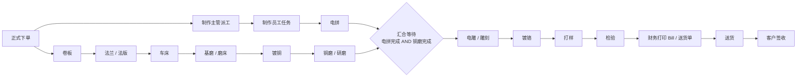
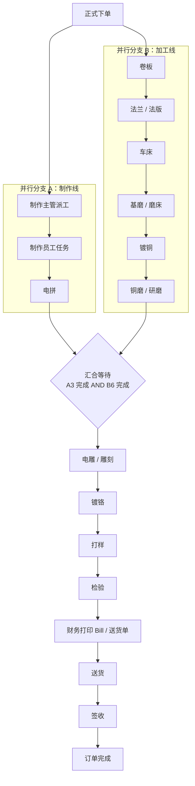

# ERP v2 可配置并行流程升级 PRD 与技术设计

版本：v2.0 草案  
日期：2026-06-08  
适用项目：`D:\ERP 2`  
建议技术栈：Vue 3 + TypeScript + Element Plus + FastAPI + PostgreSQL + JWT/RBAC + Docker Compose

---

## 第一部分：新流程业务理解

本次升级的核心不是增加若干页面，而是把现有偏线性的 ERP 生产流转升级为“前置看样流程 + 正式下单 + 双线并行生产 + 汇合等待 + 后续生产 + 检验 + 财务 Bill + 送货签收 + 异常返工”的完整闭环系统。

系统必须支持三类流程能力：

1. 可配置流程模板：工序节点、节点归属部门、流转关系、并行分支、汇合节点、跳过规则、异常路线均配置化。
2. 订单流程实例：每张正式订单创建独立流程实例，运行时记录每个节点的状态、负责人、开始完成时间、等待原因和操作日志。
3. 部门任务视图：不同部门、角色和员工只看到自己可处理的数据、菜单和按钮。

正常正式订单的主流程如下：



关键业务判断：

1. 正式下单后必须同时生成制作线与加工线任务。
2. 制作线必须经过制作主管派工，员工完成后提交到电拼。
3. 只有电拼完成且铜磨/研磨完成，才允许进入电雕/雕刻。
4. 检验通过后才能生成财务待处理任务。
5. 财务 Bill 未打印或未放行，订单不能进入送货。
6. 送货完成后必须签收，签收后订单才算完结。
7. 重制、改版、退镀、返工、补雕等异常流程不能写死，必须由用户选择工序路径并保留审批与日志。

---

## 第二部分：新旧系统差异分析

| 维度 | 当前系统 v1.2 口径 | v2 升级目标 | 影响范围 |
|---|---|---|---|
| 流程模型 | 工艺路线偏串行，部分制版厂页面已扩展 | DAG 流程模板，支持并行、汇合、回退、跳过、异常插入 | 数据库、服务层、工单页面、看板 |
| 下单前置 | 主要围绕正式订单 | 新增设计/看样前置单，客户通过后才能转正式订单 | 新页面、新表、新 API |
| 正式下单 | 支持制版订单类型 | 正式下单触发双线并行流程实例 | 订单服务、流程引擎 |
| 制作派工 | 通用派工 | 制作主管可拆分套数给多个员工，员工只见个人任务 | 新派工表、员工任务页 |
| 并行汇合 | 无强制 AND 汇合 | 电拼与铜磨都完成后才生成电雕/雕刻任务 | 流程节点状态、自动流转 |
| 异常流程 | 有返工、退镀等业务雏形 | 异常类型 + 可选加工节点 + 是否检验/财务/送货 | 异常流程配置、审批 |
| 财务 Bill | 已有应收、收据、日收入、客户账单 | 明确检验后进入财务 Bill，Bill/送货单打印后放行 | 财务任务状态与打印日志 |
| 送货签收 | 支持送货、签收 | 财务放行后才能送货，签收作为闭环终态 | 送货权限、状态机 |
| 权限 | RBAC 基础 | 菜单、按钮、节点操作、数据范围统一控制 | 权限字典、前后端拦截 |
| 首页看板 | 已有看板和统计 | 显示双线进度、汇合卡点、待 Bill、待送货、待签收 | Dashboard API 与 UI |

---

## 第三部分：升级后的完整 PRD

### 3.1 产品目标

1. 用可配置 DAG 流程引擎替代硬编码线性流转。
2. 支持前置设计/看样单到正式订单的受控转换。
3. 支持正式订单双线并行生产和汇合等待。
4. 支持制作主管按套数拆分派工、多员工提交、电拼批次接收。
5. 支持各生产部门独立任务页、报工、退回、异常备注和附件上传。
6. 支持检验、返工、异常流程选择与审批。
7. 支持财务 Bill、送货单打印、财务放行、送货、客户签收。
8. 支持订单主页面完整展示当前节点、分支进度、等待原因和闭环状态。

### 3.2 用户角色

| 角色 | 典型用户 | 核心职责 |
|---|---|---|
| 系统管理员 | IT/老板授权账号 | 用户、角色、部门、流程模板、系统配置 |
| 管理层 | 老板/总经理 | 查看全局进度、异常、财务与交付状态 |
| 生产主管 | 生产负责人 | 监控流程、处理汇合卡点、强制调整流程 |
| 制作主管 | 制作部门负责人 | 接收制作任务、拆分派工、调整员工任务 |
| 制作员工 | 制作人员 | 查看个人制作任务、提交完成套数和附件 |
| 工序员工 | 卷板、车床、磨床等 | 接收、开始、暂停、完成、退回工序任务 |
| 电拼员工 | 电拼部门 | 接收制作批次、完成电拼 |
| 检验员 | QC | 检验通过/不通过、发起返工 |
| 财务 | 财务人员 | 打印 Bill/送货单、修改 Bill、放行送货 |
| 送货人员 | 物流/司机/业务 | 创建送货记录、上传凭证、标记送货 |
| 业务员 | 销售/业务 | 创建前置单/正式单、查看客户订单进度 |

### 3.3 业务范围

MVP 必须包含：

1. 前置设计/看样单：创建、客户通过、客户驳回、转正式订单。
2. 正式订单：正常生产与异常类型下单。
3. DAG 流程模板：正常主流程模板、异常流程可选节点。
4. 订单流程实例：节点激活、完成、等待、汇合、自动生成任务。
5. 制作派工：主管分配、员工提交、电拼批次。
6. 加工线工序：卷板、法兰/法版、车床、基磨/磨床、镀铜、铜磨/研磨。
7. 汇合后工序：电雕/雕刻、镀铬、打样、检验。
8. 财务 Bill：待处理、打印、重打、放行。
9. 送货签收：送货单、送货凭证、签收单。
10. 权限、日志、附件、首页看板。

暂缓到完整版本：

1. 移动端扫码报工。
2. 自动排产和产能负荷算法。
3. 对接外部财务软件和电子发票。
4. 客户门户在线确认样张和签收。
5. 高级 BI、绩效、成本预测。

### 3.4 关键验收标准

1. 正常订单创建后，制作线与加工线两个分支同时出现任务。
2. 电拼未完成或铜磨未完成时，电雕/雕刻任务不可开始，页面显示等待原因。
3. 两个分支都完成后，系统自动或经生产主管确认生成电雕/雕刻任务。
4. 制作员工只能查看自己被分配的任务。
5. 制作主管可查看每个员工分配数、完成数、未完成数和进度。
6. 财务未放行前，送货页面不能生成送货任务。
7. 所有关键状态变化写入 `operation_logs` 和节点历史。
8. 异常订单必须选择加工流程，且不能把送货/签收作为加工节点。

---

## 第四部分：部门与权限矩阵

### 4.1 部门清单

系统部门包括：法版、接稿、电分、制作、卷板、车床、磨床、镀铜、研磨、电拼、雕刻/电雕、镀铬、打样、检验、财务、生产、退镀、业务、维修、图文设计。

### 4.2 权限矩阵

| 模块/动作 | 管理员 | 管理层 | 生产主管 | 制作主管 | 制作员工 | 工序员工 | 检验 | 财务 | 业务 | 送货 |
|---|---|---|---|---|---|---|---|---|---|---|
| 首页全局看板 | 全部 | 只读全部 | 全部生产 | 制作范围 | 个人 | 本部门 | 检验范围 | 财务范围 | 客户/本人 | 送货范围 |
| 创建前置单 | 是 | 否 | 否 | 否 | 否 | 否 | 否 | 否 | 是 | 否 |
| 前置单转正式订单 | 是 | 审批 | 是 | 否 | 否 | 否 | 否 | 否 | 本人 | 否 |
| 创建正式订单 | 是 | 否 | 是 | 否 | 否 | 否 | 否 | 否 | 是 | 否 |
| 配置流程模板 | 是 | 只读 | 建议只读 | 否 | 否 | 否 | 否 | 否 | 否 | 否 |
| 制作派工 | 是 | 只读 | 是 | 是 | 否 | 否 | 否 | 否 | 否 | 否 |
| 制作员工报工 | 是 | 否 | 是 | 是 | 个人 | 否 | 否 | 否 | 否 | 否 |
| 工序接收/开始/完成 | 是 | 否 | 是 | 否 | 否 | 本部门 | 否 | 否 | 否 | 否 |
| 检验提交 | 是 | 只读 | 是 | 否 | 否 | 否 | 是 | 否 | 否 | 否 |
| 发起返工 | 是 | 只读 | 是 | 否 | 否 | 否 | 是 | 否 | 否 | 否 |
| Bill 打印/重打 | 是 | 只读 | 否 | 否 | 否 | 否 | 否 | 是 | 只读 | 否 |
| 财务放行 | 是 | 只读 | 否 | 否 | 否 | 否 | 否 | 是 | 只读 | 否 |
| 送货/签收 | 是 | 只读 | 是 | 否 | 否 | 否 | 否 | 只读 | 本人客户 | 是 |
| 强制调整流程 | 是 | 审批 | 是 | 否 | 否 | 否 | 否 | 否 | 否 | 否 |

### 4.3 权限实现

1. 菜单权限：前端导航按 `menu:*` 权限过滤。
2. 按钮权限：关键按钮使用 `action:*` 权限控制，后端再次校验。
3. 数据权限：按 `all`、`department`、`self`、`customer_owner`、`assigned` 范围过滤。
4. 节点权限：流程节点配置 `department_id` 与 `required_permission`，任务操作时校验用户部门与权限。
5. 强制操作：生产主管/管理员可强制调整，但必须填写原因并写入日志。

---

## 第五部分：主流程图设计

### 5.1 正常流程模板



### 5.2 首页流程展示

订单卡片必须显示：

1. 主状态：草稿、生产中、等待汇合、待检验、待 Bill、待送货、待签收、已完成、异常中。
2. 当前节点：可有多个并行当前节点。
3. 制作线状态：未开始、派工中、制作中、电拼中、已完成。
4. 加工线状态：当前工序、完成百分比、是否卡点。
5. 汇合条件：电拼完成状态、铜磨完成状态、是否满足进入电雕。
6. 财务与交付：Bill 状态、送货状态、签收状态。

---

## 第六部分：设计 / 看样前置流程设计

### 6.1 流程定位

设计/看样单是正式生产订单之前的前置流程，不参与正式生产统计。客户未确认通过前，不能转正式订单。

### 6.2 字段

| 字段 | 类型 | 必填 | 说明 |
|---|---:|---|---|
| pre_order_no | varchar(64) | 是 | 前置单号 |
| sample_no | varchar(64) | 是 | SampleNo |
| customer_name | varchar(128) | 是 | 客户名称 |
| product_name | varchar(128) | 是 | 产品名称 |
| type | varchar(64) | 否 | Type |
| order_time | timestamptz | 是 | 下单时间 |
| salesperson_id | bigint | 是 | 业务员 |
| num | numeric(12,2) | 是 | 数量 |
| receiver_id | bigint | 否 | 接活人 |
| print_color | varchar(128) | 否 | 印色 |
| remarks | text | 否 | 备注 |
| status | varchar(32) | 是 | 前置单状态 |

### 6.3 状态

草稿 -> 已提交 -> 设计/看样中 -> 待客户确认 -> 客户已通过 -> 已转正式订单  
待客户确认 -> 客户驳回 -> 设计/看样中  
任意非已转正式订单状态 -> 已取消

### 6.4 规则

1. 客户未通过不能转正式订单。
2. 转正式订单时带入 SampleNo、客户、产品、Type、数量、业务员、接活人、印色、备注。
3. 前置单与正式订单必须保留 `source_pre_order_id` 和 `converted_order_id`。
4. 多次改样必须记录版本，可在 MVP 中先用附件和日志保留，完整版增加 `pre_order_versions`。

---

## 第七部分：制作主管派工流程设计

### 7.1 业务流程

1. 正式下单后，制作线第一个节点不是员工任务，而是“制作主管派工”。
2. 制作主管选择多个制作员工，设置每人应完成套数。
3. 系统校验分配总套数不能超过订单数量，管理员授权可例外。
4. 员工只看到自己的制作任务。
5. 员工提交完成套数、完成时间、备注和附件。
6. 员工完成后可提交到电拼，系统生成电拼批次。
7. 制作任务总完成套数达到订单数量，且电拼完成后，制作线才算完成。

### 7.2 校验规则

| 场景 | 校验 |
|---|---|
| 分配套数超过订单数量 | 禁止，除非具备 `making.assignment.override` |
| 分配套数不足 | 允许保存，但订单显示“制作未完全分配” |
| 员工完成数大于分配数 | 禁止，除非主管审批 |
| 撤回任务 | 已提交到电拼的任务不能直接撤回，需走更正/作废审批 |
| 追加分配 | 允许，但必须记录原分配和新分配 |

### 7.3 主管看板

展示字段：订单号、SampleNo、客户、产品、订单数量、已分配、未分配、员工、分配套数、完成套数、未完成套数、进度、是否提交电拼、异常备注。

---

## 第八部分：并行流程与汇合节点设计

### 8.1 DAG 流程引擎口径

流程模板由节点和边组成。一个节点可有多个前置节点，也可有多个后继节点。节点是否可激活由前置边条件和节点条件共同决定。

节点类型：

| node_type | 说明 |
|---|---|
| start | 开始节点 |
| task | 普通人工任务 |
| auto | 自动节点 |
| dispatch | 主管派工节点 |
| join | 汇合等待节点 |
| finance | 财务节点 |
| delivery | 送货节点 |
| sign | 签收节点 |
| end | 结束节点 |

边条件：

| condition_type | 说明 |
|---|---|
| always | 前置完成即可流转 |
| all_success | 所有前置节点完成 |
| any_success | 任一前置节点完成 |
| expression | 按表达式判断，例如 `epin.completed && copper_grind.completed` |
| manual_confirm | 满足条件后仍需人工确认 |

### 8.2 汇合节点规则

汇合节点 `join_before_engraving` 的前置节点为 `epin` 与 `copper_grind`。

激活条件：

```text
epin.status == completed
AND copper_grind.status == completed
```

如果未满足：

1. 后续电雕/雕刻节点保持 `blocked` 或 `waiting`。
2. 订单显示等待原因：等待电拼完成、等待铜磨完成或两者都等待。
3. 生产主管看板显示卡点和滞留时长。

满足后：

1. 自动生成电雕/雕刻任务，或根据模板配置转为“待生产主管确认”。
2. 汇合节点写入完成时间。
3. 后续串行节点按模板依次激活。

---

## 第九部分：异常流程设计

### 9.1 异常类型

| 类型 | 说明 | 默认建议 |
|---|---|---|
| remake | 重制 | 可完整重走主流程，允许裁剪节点 |
| revision | 改版 | 可选择制作、电拼、电雕、打样、检验等节点 |
| dechrome | 退镀 | 必须进入退镀部门任务，可接镀铬/打样/检验 |
| rework | 返工 | 必须填写返工原因，通常由检验不通过发起 |
| supplement_engraving | 补雕 | 默认从电雕/雕刻开始，主管可调整 |

### 9.2 异常流程选择

当订单类型不为正常生产时，必须弹出“选择加工流程”：

1. 选择从哪一道工序开始。
2. 选择需要经过哪些后续工序。
3. 选择是否重新检验。
4. 选择是否重新走财务 Bill。
5. 选择是否重新送货。送货和签收不能作为加工节点，只能作为后续交付流程。
6. 填写异常原因、发起人、审批人和备注。

### 9.3 可选加工节点

制作、电拼、卷板、法兰/法版、车床、基磨/磨床、镀铜、铜磨/研磨、电雕/雕刻、镀铬、打样、检验、财务 Bill、退镀、维修、其他配置工序。

禁止作为加工节点：送货、签收。

---

## 第十部分：财务 Bill 与送货签收流程

### 10.1 财务 Bill

检验通过后，系统自动生成财务待处理任务。财务页面展示：订单号、SampleNo、客户、产品、Type、数量、业务员、送货信息、金额信息、Bill 状态、送货单状态。

财务动作：

1. 打印 Bill。
2. 打印送货单。
3. 修改 Bill 信息。
4. 标记 Bill 已打印。
5. 标记送货单已打印。
6. 财务放行送货。
7. 查看历史 Bill。
8. 重打。
9. 导出 Excel/PDF。

规则：

1. 未检验通过不能进入财务 Bill。
2. Bill 未打印或财务未放行不能送货。
3. Bill 打印、修改、重打、放行必须记录日志。

### 10.2 送货与签收

财务放行后，订单进入送货流程。送货页面支持：生成送货单、打印送货单、填写送货时间、送货人/司机/物流、客户地址、上传送货凭证、标记已送货、上传签收单、标记客户已签收。

签收后：

1. 订单状态变为已签收/已完成。
2. 生产流程结束。
3. 财务、业务、管理层可查看签收记录。
4. 系统保留完整流程流转记录。

---

## 第十一部分：数据库升级设计

数据库采用 PostgreSQL。主键统一 `bigserial`，时间统一 `timestamptz`，状态统一 `varchar(32)` 并由应用层枚举控制。所有业务表建议保留 `created_at`、`updated_at`，关键业务状态变化另写历史和日志。

### 11.1 表总览

| 表名 | 业务含义 |
|---|---|
| departments | 部门 |
| roles | 角色 |
| permissions | 权限点 |
| users | 用户 |
| role_permissions | 角色权限关联 |
| pre_orders | 前置设计/看样单 |
| orders | 正式订单 |
| workflow_templates | 流程模板 |
| workflow_nodes | 流程模板节点 |
| workflow_edges | 流程模板边 |
| order_workflows | 订单流程实例 |
| order_workflow_nodes | 订单流程节点实例 |
| production_tasks | 生产任务 |
| making_assignments | 制作派工 |
| epin_batches | 电拼批次 |
| inspection_records | 检验记录 |
| abnormal_process_records | 异常流程记录 |
| finance_bills | 财务 Bill |
| delivery_orders | 送货单 |
| sign_records | 签收记录 |
| files | 附件 |
| operation_logs | 操作日志 |

### 11.2 核心表定义

#### departments

| 字段 | 类型 | 约束 | 含义 |
|---|---|---|---|
| id | bigserial | PK | 部门 ID |
| dept_code | varchar(64) | unique, not null | 部门编码 |
| dept_name | varchar(128) | not null | 部门名称 |
| parent_id | bigint | FK departments.id | 上级部门 |
| is_production | boolean | not null default false | 是否生产部门 |
| is_active | boolean | not null default true | 是否启用 |
| created_at | timestamptz | not null | 创建时间 |

索引：`uk_departments_dept_code`，`idx_departments_parent_id`，`idx_departments_active`。

#### roles

| 字段 | 类型 | 约束 | 含义 |
|---|---|---|---|
| id | bigserial | PK | 角色 ID |
| role_code | varchar(64) | unique, not null | 角色编码 |
| role_name | varchar(128) | not null | 角色名称 |
| data_scope | varchar(32) | not null | all/department/self/assigned |
| is_active | boolean | not null default true | 是否启用 |
| created_at | timestamptz | not null | 创建时间 |

索引：`uk_roles_role_code`，`idx_roles_active`。

#### permissions

| 字段 | 类型 | 约束 | 含义 |
|---|---|---|---|
| id | bigserial | PK | 权限 ID |
| permission_code | varchar(128) | unique, not null | 权限编码 |
| permission_name | varchar(128) | not null | 权限名称 |
| permission_type | varchar(32) | not null | menu/action/api/data |
| parent_id | bigint | FK permissions.id | 上级权限 |
| created_at | timestamptz | not null | 创建时间 |

索引：`uk_permissions_code`，`idx_permissions_parent_id`。

#### users

| 字段 | 类型 | 约束 | 含义 |
|---|---|---|---|
| id | bigserial | PK | 用户 ID |
| username | varchar(64) | unique, not null | 登录名 |
| password_hash | varchar(255) | not null | 密码哈希 |
| full_name | varchar(128) | not null | 姓名 |
| department_id | bigint | FK departments.id | 所属部门 |
| role_id | bigint | FK roles.id | 默认角色 |
| is_active | boolean | not null default true | 是否启用 |
| last_login_at | timestamptz | nullable | 最后登录时间 |
| created_at | timestamptz | not null | 创建时间 |

索引：`uk_users_username`，`idx_users_department_id`，`idx_users_role_id`。

#### role_permissions

| 字段 | 类型 | 约束 | 含义 |
|---|---|---|---|
| role_id | bigint | PK, FK roles.id | 角色 |
| permission_id | bigint | PK, FK permissions.id | 权限 |
| created_at | timestamptz | not null | 授权时间 |

索引：`idx_role_permissions_permission_id`。

#### pre_orders

| 字段 | 类型 | 约束 | 含义 |
|---|---|---|---|
| id | bigserial | PK | 前置单 ID |
| pre_order_no | varchar(64) | unique, not null | 前置单号 |
| sample_no | varchar(64) | not null | SampleNo |
| customer_name | varchar(128) | not null | 客户名称 |
| product_name | varchar(128) | not null | 产品名称 |
| type | varchar(64) | nullable | Type |
| order_time | timestamptz | not null | 下单时间 |
| salesperson_id | bigint | FK users.id | 业务员 |
| num | numeric(12,2) | not null | 数量 |
| receiver_id | bigint | FK users.id | 接活人 |
| print_color | varchar(128) | nullable | 印色 |
| remarks | text | nullable | 备注 |
| status | varchar(32) | not null | 前置单状态 |
| customer_confirmed_at | timestamptz | nullable | 客户通过时间 |
| converted_order_id | bigint | FK orders.id | 转出的正式订单 |
| created_by | bigint | FK users.id | 创建人 |
| created_at | timestamptz | not null | 创建时间 |
| updated_at | timestamptz | not null | 更新时间 |

索引：`uk_pre_orders_no`，`idx_pre_orders_status`，`idx_pre_orders_sample_no`，`idx_pre_orders_salesperson_id`。

#### orders

| 字段 | 类型 | 约束 | 含义 |
|---|---|---|---|
| id | bigserial | PK | 订单 ID |
| order_no | varchar(64) | unique, not null | 正式订单号 |
| sample_no | varchar(64) | not null | SampleNo |
| customer_name | varchar(128) | not null | 客户名称 |
| product_name | varchar(128) | not null | 产品名称 |
| type | varchar(64) | nullable | Type |
| order_time | timestamptz | not null | 下单时间 |
| salesperson_id | bigint | FK users.id | 业务员 |
| num | numeric(12,2) | not null | 数量 |
| receiver_id | bigint | FK users.id | 接活人 |
| print_color | varchar(128) | nullable | 印色 |
| remarks | text | nullable | 备注 |
| due_date | date | nullable | 交货日期 |
| priority | varchar(32) | not null default 'normal' | 优先级 |
| order_type | varchar(32) | not null | normal/remake/revision/dechrome/rework/supplement_engraving |
| source_pre_order_id | bigint | FK pre_orders.id | 来源前置单 |
| status | varchar(32) | not null | 订单状态 |
| created_by | bigint | FK users.id | 创建人 |
| created_at | timestamptz | not null | 创建时间 |
| updated_at | timestamptz | not null | 更新时间 |

索引：`uk_orders_order_no`，`idx_orders_status`，`idx_orders_type`，`idx_orders_sample_no`，`idx_orders_salesperson_id`，`idx_orders_due_date`。

#### workflow_templates

| 字段 | 类型 | 约束 | 含义 |
|---|---|---|---|
| id | bigserial | PK | 模板 ID |
| template_name | varchar(128) | not null | 模板名称 |
| template_type | varchar(32) | not null | normal/abnormal/pre_order |
| version | integer | not null default 1 | 模板版本 |
| is_default | boolean | not null default false | 是否默认 |
| is_active | boolean | not null default true | 是否启用 |
| created_at | timestamptz | not null | 创建时间 |

索引：`idx_workflow_templates_type_active`，唯一建议：同类型仅一个默认启用模板。

#### workflow_nodes

| 字段 | 类型 | 约束 | 含义 |
|---|---|---|---|
| id | bigserial | PK | 节点 ID |
| template_id | bigint | FK workflow_templates.id, not null | 所属模板 |
| node_code | varchar(64) | not null | 节点编码 |
| node_name | varchar(128) | not null | 节点名称 |
| department_id | bigint | FK departments.id | 负责部门 |
| node_type | varchar(32) | not null | start/task/dispatch/join/finance/delivery/sign/end |
| sort_order | integer | not null default 0 | 展示排序 |
| is_parallel_node | boolean | not null default false | 是否并行节点 |
| is_join_node | boolean | not null default false | 是否汇合节点 |
| is_required | boolean | not null default true | 是否必经 |
| allow_skip | boolean | not null default false | 是否允许跳过 |
| required_permission | varchar(128) | nullable | 操作权限 |
| created_at | timestamptz | not null | 创建时间 |

索引：`idx_workflow_nodes_template_id`，`uk_workflow_nodes_template_code(template_id,node_code)`，`idx_workflow_nodes_department_id`。

#### workflow_edges

| 字段 | 类型 | 约束 | 含义 |
|---|---|---|---|
| id | bigserial | PK | 边 ID |
| template_id | bigint | FK workflow_templates.id, not null | 模板 |
| from_node_id | bigint | FK workflow_nodes.id, not null | 前置节点 |
| to_node_id | bigint | FK workflow_nodes.id, not null | 后继节点 |
| condition_type | varchar(32) | not null default 'always' | always/all_success/any_success/expression/manual_confirm |
| condition_expression | text | nullable | 条件表达式 |
| created_at | timestamptz | not null | 创建时间 |

索引：`idx_workflow_edges_template_id`，`idx_workflow_edges_from`，`idx_workflow_edges_to`。

#### order_workflows

| 字段 | 类型 | 约束 | 含义 |
|---|---|---|---|
| id | bigserial | PK | 流程实例 ID |
| order_id | bigint | FK orders.id, unique, not null | 订单 |
| template_id | bigint | FK workflow_templates.id, not null | 模板 |
| status | varchar(32) | not null | running/completed/cancelled/abnormal |
| started_at | timestamptz | not null | 启动时间 |
| completed_at | timestamptz | nullable | 完成时间 |

索引：`uk_order_workflows_order_id`，`idx_order_workflows_status`。

#### order_workflow_nodes

| 字段 | 类型 | 约束 | 含义 |
|---|---|---|---|
| id | bigserial | PK | 节点实例 ID |
| order_workflow_id | bigint | FK order_workflows.id, not null | 流程实例 |
| order_id | bigint | FK orders.id, not null | 订单 |
| node_id | bigint | FK workflow_nodes.id, not null | 模板节点 |
| node_code | varchar(64) | not null | 节点编码快照 |
| node_name | varchar(128) | not null | 节点名称快照 |
| department_id | bigint | FK departments.id | 负责部门 |
| status | varchar(32) | not null | pending/active/in_progress/waiting/blocked/completed/skipped/returned/cancelled |
| assigned_user_id | bigint | FK users.id | 负责人 |
| started_at | timestamptz | nullable | 开始时间 |
| completed_at | timestamptz | nullable | 完成时间 |
| waiting_reason | text | nullable | 等待原因 |
| is_current | boolean | not null default false | 是否当前节点 |
| remarks | text | nullable | 备注 |

索引：`idx_own_order_id`，`idx_own_status`，`idx_own_department_status`，`idx_own_current`，`idx_own_node_code`。

#### production_tasks

| 字段 | 类型 | 约束 | 含义 |
|---|---|---|---|
| id | bigserial | PK | 生产任务 ID |
| order_id | bigint | FK orders.id, not null | 订单 |
| workflow_node_instance_id | bigint | FK order_workflow_nodes.id, not null | 节点实例 |
| department_id | bigint | FK departments.id, not null | 部门 |
| assigned_user_id | bigint | FK users.id | 员工 |
| task_status | varchar(32) | not null | pending/accepted/processing/paused/completed/returned/cancelled |
| planned_num | numeric(12,2) | not null default 0 | 计划数量 |
| completed_num | numeric(12,2) | not null default 0 | 完成数量 |
| bad_num | numeric(12,2) | not null default 0 | 不良数量 |
| started_at | timestamptz | nullable | 开始时间 |
| completed_at | timestamptz | nullable | 完成时间 |
| remarks | text | nullable | 备注 |

索引：`idx_tasks_order_id`，`idx_tasks_department_status`，`idx_tasks_assigned_user`，`idx_tasks_node_instance`。

#### making_assignments

| 字段 | 类型 | 约束 | 含义 |
|---|---|---|---|
| id | bigserial | PK | 派工 ID |
| order_id | bigint | FK orders.id, not null | 订单 |
| making_task_id | bigint | FK production_tasks.id, not null | 制作任务 |
| supervisor_id | bigint | FK users.id, not null | 制作主管 |
| employee_id | bigint | FK users.id, not null | 制作员工 |
| assigned_sets | numeric(12,2) | not null | 分配套数 |
| completed_sets | numeric(12,2) | not null default 0 | 完成套数 |
| status | varchar(32) | not null | assigned/processing/submitted/completed/recalled/cancelled |
| submitted_to_epin_at | timestamptz | nullable | 提交电拼时间 |
| remarks | text | nullable | 备注 |
| created_at | timestamptz | not null | 创建时间 |
| updated_at | timestamptz | not null | 更新时间 |

索引：`idx_making_order_id`，`idx_making_employee_status`，`idx_making_task_id`。

#### epin_batches

| 字段 | 类型 | 约束 | 含义 |
|---|---|---|---|
| id | bigserial | PK | 电拼批次 ID |
| order_id | bigint | FK orders.id, not null | 订单 |
| making_assignment_id | bigint | FK making_assignments.id, not null | 来源制作派工 |
| employee_id | bigint | FK users.id, not null | 制作员工 |
| sets_count | numeric(12,2) | not null | 批次数量 |
| status | varchar(32) | not null | submitted/received/processing/completed/rejected |
| received_by | bigint | FK users.id | 接收人 |
| received_at | timestamptz | nullable | 接收时间 |
| completed_at | timestamptz | nullable | 完成时间 |
| remarks | text | nullable | 备注 |

索引：`idx_epin_order_id`，`idx_epin_status`，`idx_epin_assignment_id`。

#### inspection_records

| 字段 | 类型 | 约束 | 含义 |
|---|---|---|---|
| id | bigserial | PK | 检验记录 ID |
| order_id | bigint | FK orders.id, not null | 订单 |
| workflow_node_instance_id | bigint | FK order_workflow_nodes.id | 检验节点 |
| inspector_id | bigint | FK users.id, not null | 检验员 |
| result | varchar(32) | not null | passed/failed |
| bad_reason | text | nullable | 不良原因 |
| rework_required | boolean | not null default false | 是否返工 |
| rework_flow_id | bigint | FK abnormal_process_records.id | 返工流程 |
| inspected_at | timestamptz | not null | 检验时间 |
| remarks | text | nullable | 备注 |

索引：`idx_inspection_order_id`，`idx_inspection_result`，`idx_inspection_inspector`。

#### abnormal_process_records

| 字段 | 类型 | 约束 | 含义 |
|---|---|---|---|
| id | bigserial | PK | 异常流程 ID |
| order_id | bigint | FK orders.id, not null | 订单 |
| abnormal_type | varchar(32) | not null | remake/revision/dechrome/rework/supplement_engraving |
| reason | text | not null | 原因 |
| selected_start_node | varchar(64) | not null | 起始节点 |
| selected_process_nodes | jsonb | not null | 选择的加工节点 |
| need_inspection | boolean | not null default true | 是否重新检验 |
| need_finance_bill | boolean | not null default false | 是否重新走 Bill |
| need_delivery | boolean | not null default false | 是否重新送货 |
| initiated_by | bigint | FK users.id, not null | 发起人 |
| approved_by | bigint | FK users.id | 审批人 |
| status | varchar(32) | not null | draft/pending_approval/approved/rejected/running/completed |
| created_at | timestamptz | not null | 创建时间 |
| updated_at | timestamptz | not null | 更新时间 |

索引：`idx_abnormal_order_id`，`idx_abnormal_type`，`idx_abnormal_status`。

#### finance_bills

| 字段 | 类型 | 约束 | 含义 |
|---|---|---|---|
| id | bigserial | PK | Bill ID |
| bill_no | varchar(64) | unique, not null | Bill 编号 |
| order_id | bigint | FK orders.id, not null | 订单 |
| customer_name | varchar(128) | not null | 客户 |
| amount | numeric(14,2) | not null default 0 | 金额 |
| bill_status | varchar(32) | not null | pending/printed/reprinted/released/cancelled |
| printed_by | bigint | FK users.id | 打印人 |
| printed_at | timestamptz | nullable | 打印时间 |
| released_by | bigint | FK users.id | 放行人 |
| released_at | timestamptz | nullable | 放行时间 |
| reprint_count | integer | not null default 0 | 重打次数 |
| remarks | text | nullable | 备注 |

索引：`uk_finance_bills_no`，`idx_finance_bills_order_id`，`idx_finance_bills_status`。

#### delivery_orders

| 字段 | 类型 | 约束 | 含义 |
|---|---|---|---|
| id | bigserial | PK | 送货单 ID |
| delivery_no | varchar(64) | unique, not null | 送货单号 |
| order_id | bigint | FK orders.id, not null | 订单 |
| customer_name | varchar(128) | not null | 客户 |
| delivery_address | varchar(255) | nullable | 地址 |
| delivery_user_id | bigint | FK users.id | 送货人 |
| delivery_time | timestamptz | nullable | 送货时间 |
| status | varchar(32) | not null | pending/printed/shipped/signed/cancelled |
| printed_by | bigint | FK users.id | 打印人 |
| printed_at | timestamptz | nullable | 打印时间 |
| remarks | text | nullable | 备注 |

索引：`uk_delivery_orders_no`，`idx_delivery_orders_order_id`，`idx_delivery_orders_status`。

#### sign_records

| 字段 | 类型 | 约束 | 含义 |
|---|---|---|---|
| id | bigserial | PK | 签收记录 ID |
| delivery_order_id | bigint | FK delivery_orders.id, not null | 送货单 |
| order_id | bigint | FK orders.id, not null | 订单 |
| signed_by | varchar(128) | not null | 客户签收人 |
| signed_at | timestamptz | not null | 签收时间 |
| sign_image_file_id | bigint | FK files.id | 签收附件 |
| remarks | text | nullable | 备注 |

索引：`idx_sign_delivery_order_id`，`idx_sign_order_id`。

#### files

| 字段 | 类型 | 约束 | 含义 |
|---|---|---|---|
| id | bigserial | PK | 文件 ID |
| related_type | varchar(64) | not null | 关联类型 |
| related_id | bigint | not null | 关联 ID |
| file_name | varchar(255) | not null | 文件名 |
| file_url | varchar(512) | not null | 文件路径 |
| file_type | varchar(64) | nullable | 文件类型 |
| uploaded_by | bigint | FK users.id, not null | 上传人 |
| uploaded_at | timestamptz | not null | 上传时间 |

索引：`idx_files_related`，`idx_files_uploaded_by`。

#### operation_logs

| 字段 | 类型 | 约束 | 含义 |
|---|---|---|---|
| id | bigserial | PK | 日志 ID |
| user_id | bigint | FK users.id | 操作人 |
| action | varchar(128) | not null | 动作 |
| target_type | varchar(64) | not null | 对象类型 |
| target_id | bigint | not null | 对象 ID |
| before_data | jsonb | nullable | 操作前快照 |
| after_data | jsonb | nullable | 操作后快照 |
| ip_address | varchar(64) | nullable | IP |
| created_at | timestamptz | not null | 操作时间 |

索引：`idx_logs_user_id`，`idx_logs_target`，`idx_logs_action`，`idx_logs_created_at`。

---

## 第十二部分：核心状态机设计

### 12.1 前置单状态

```text
draft -> submitted -> designing -> waiting_customer_confirm -> customer_approved -> converted
waiting_customer_confirm -> customer_rejected -> designing
draft/submitted/designing/waiting_customer_confirm/customer_rejected -> cancelled
```

### 12.2 订单状态

```text
draft -> submitted -> workflow_running -> waiting_join -> post_join_processing
post_join_processing -> waiting_inspection -> waiting_finance_bill -> waiting_delivery -> waiting_sign -> completed
workflow_running/post_join_processing/waiting_inspection -> abnormal_processing -> workflow_running
任意未完成状态 -> cancelled
```

### 12.3 节点实例状态

```text
pending -> active -> in_progress -> completed
active/in_progress -> paused -> in_progress
active/in_progress -> returned -> active
pending/active -> skipped
pending/active/in_progress -> blocked
blocked -> active
任意未完成状态 -> cancelled
```

### 12.4 生产任务状态

```text
pending -> accepted -> processing -> completed
processing -> paused -> processing
pending/accepted/processing -> returned
pending/accepted/processing -> cancelled
```

### 12.5 财务与交付状态

Bill：`pending -> printed -> released`，`printed -> reprinted -> released`，任意未放行可 `cancelled`。  
送货：`pending -> printed -> shipped -> signed`。  
签收：`pending -> signed`。

---

## 第十三部分：前端页面设计

| 页面 | 核心内容 | 关键操作 |
|---|---|---|
| 登录页 | 用户名、密码、语言/记住登录 | 登录 |
| 首页/主看板 | 订单总览、双线进度、卡点、逾期、待 Bill、待送货、待签收 | 筛选、进入详情 |
| 订单列表 | 单号、SampleNo、客户、产品、Type、数量、当前流程、分支状态、财务/送货/签收 | 查看、编辑、发起异常 |
| 订单详情 | 基本信息、流程图、并行线、当前节点、负责人、派工、加工、检验、Bill、送货、日志 | 节点操作、上传附件 |
| 正式下单 | 正常生产、重制、改版、退镀、返工、补雕、附件 | 保存、提交、选择异常流程 |
| 前置下单 | 简化字段、附件、业务员 | 保存、提交 |
| 前置单详情 | 客户确认状态、版本、附件、关联正式单 | 客户通过、客户驳回、转正式订单 |
| 制作主管派工 | 待制作订单、员工、分配套数、总分配、剩余 | 保存派工、调整派工、撤回 |
| 制作员工我的任务 | 个人制作任务、分配套数、完成套数 | 提交完成、上传附件、提交电拼 |
| 电拼任务 | 制作批次、订单总数、已接收、待电拼 | 接收、开始、完成、退回 |
| 各工序任务 | 本部门待处理、加工中、已完成、异常 | 接收、开始、暂停、完成、退回 |
| 检验页 | 待检验列表、结果、不通过原因 | 提交检验、发起返工 |
| 异常流程页 | 异常类型、节点选择、审批、任务生成 | 提交、审批、生成任务 |
| 财务 Bill 页 | 待打印、已打印、重打、送货单、放行 | 打印、修改、重打、放行、导出 |
| 送货页 | 待送货、已送货、凭证 | 生成送货单、打印、标记送货 |
| 签收页 | 待签收、签收单 | 上传签收单、标记签收 |
| 用户权限管理 | 用户、部门、角色、权限、菜单、按钮、数据范围 | 新增、编辑、禁用 |
| 流程模板配置 | 节点、并行分支、汇合节点、异常可选节点、部门 | 保存模板、启用版本 |

交互要求：

1. 首页和订单详情必须用流程图或横向节点条显示并行分支。
2. 当前用户无权限的按钮不显示，后端仍必须拒绝无权限请求。
3. 汇合节点显示两个前置条件的完成状态，而不是只显示“等待中”。
4. 异常流程选择使用多选工序列表和步骤预览，避免误把送货/签收作为加工节点。

---

## 第十四部分：API 接口设计

统一前缀：`/api/v1`。错误码建议：`400` 参数错误，`401` 未登录，`403` 无权限，`404` 不存在，`409` 状态冲突，`422` 业务校验失败。

| # | API | Method | 请求 | 返回 | 权限 | 业务校验 |
|---:|---|---|---|---|---|---|
| 1 | `/auth/login` | POST | username,password | token,user | public | 用户有效、密码正确 |
| 2 | `/me/menus` | GET | - | menus[] | login | 按角色过滤菜单 |
| 3 | `/me/permissions` | GET | - | permissions[],data_scope | login | 返回当前有效权限 |
| 4 | `/pre-orders` | POST | pre_order payload | pre_order | pre_order.create | 必填字段、单号唯一 |
| 5 | `/pre-orders/{id}/approve-customer` | POST | confirmed_at,remarks | pre_order | pre_order.confirm | 状态为待客户确认 |
| 6 | `/pre-orders/{id}/reject-customer` | POST | reason | pre_order | pre_order.reject | 状态为待客户确认 |
| 7 | `/pre-orders/{id}/convert` | POST | order fields override | order | order.create | 客户已通过、未转换 |
| 8 | `/orders` | POST | formal order payload | order | order.create | 正常生产字段完整 |
| 9 | `/orders/abnormal` | POST | abnormal order payload | order | order.abnormal.create | 必须选择异常类型 |
| 10 | `/orders/{id}/abnormal-flow` | POST | nodes,flags,reason | abnormal_record | abnormal.flow.select | 节点合法，送货/签收不可作为加工节点 |
| 11 | `/orders` | GET | filters,page | list | order.read | 应用数据范围 |
| 12 | `/orders/{id}` | GET | - | order detail | order.read | 应用数据范围 |
| 13 | `/orders/{id}/workflow-graph` | GET | - | nodes,edges,status | workflow.read | 应用数据范围 |
| 14 | `/making/orders/{id}/assignments` | POST | employee sets[] | assignments | making.assign | 总套数校验 |
| 15 | `/making/assignments/{id}/complete` | POST | completed_sets,remarks,files | assignment | making.complete.self | 完成数不能超分配数 |
| 16 | `/making/assignments/{id}/submit-epin` | POST | sets_count | epin_batch | making.submit_epin | 已完成数量足够 |
| 17 | `/epin/batches/{id}/receive` | POST | - | batch | epin.receive | 批次为 submitted |
| 18 | `/epin/batches/{id}/complete` | POST | remarks | batch | epin.complete | 批次已接收/处理中 |
| 19 | `/production-tasks/{id}/accept` | POST | - | task | task.accept | 本部门/被指派 |
| 20 | `/production-tasks/{id}/start` | POST | - | task | task.start | 前置节点已完成 |
| 21 | `/production-tasks/{id}/complete` | POST | completed_num,bad_num,remarks,files | task | task.complete | 完成数合法 |
| 22 | `/production-tasks/{id}/return` | POST | reason,target_node | task | task.return | 必填退回原因 |
| 23 | `/workflows/{order_id}/check-join` | POST | join_node_code | join status | workflow.join.check | 电拼和铜磨状态判断 |
| 24 | `/workflows/{order_id}/generate-engraving` | POST | confirm | node/task | workflow.join.release | 汇合条件满足 |
| 25 | `/inspections` | POST | order,node,result,reason | inspection | inspection.submit | 检验节点 active |
| 26 | `/inspections/{id}/rework` | POST | reason,nodes | abnormal_record | inspection.rework | result failed |
| 27 | `/finance/orders/{id}/bill` | POST | amount,items | bill | finance.bill.create | 检验通过 |
| 28 | `/finance/bills/{id}/print` | POST | template,data | bill,print_record | finance.bill.print | Bill 未取消 |
| 29 | `/finance/bills/{id}/print-delivery-note` | POST | template | delivery_note_print | finance.delivery_note.print | Bill 已打印 |
| 30 | `/finance/bills/{id}/release-delivery` | POST | remarks | bill | finance.release | Bill 已打印 |
| 31 | `/delivery-orders` | POST | order_id,address | delivery_order | delivery.create | 财务已放行 |
| 32 | `/delivery-orders/{id}/ship` | POST | delivery_time,user,proof_files | delivery_order | delivery.ship | 已创建送货单 |
| 33 | `/delivery-orders/{id}/sign-file` | POST | file | file | delivery.sign.upload | 已送货 |
| 34 | `/delivery-orders/{id}/sign` | POST | signed_by,signed_at,file_id | sign_record | delivery.sign | 已送货 |
| 35 | `/operation-logs` | GET | filters | logs | logs.read | 应用数据范围 |
| 36 | `/files/upload` | POST | multipart related_type/id | file | file.upload | 关联对象有权限 |
| 37 | `/orders/export` | GET | filters | xlsx | order.export | 应用数据范围 |
| 38 | `/finance/bills/export` | GET | filters | xlsx | finance.export | 财务权限 |
| 39 | `/users` | CRUD | user payload | user | user.manage | 用户名唯一 |
| 40 | `/departments` | CRUD | dept payload | department | dept.manage | 部门编码唯一 |
| 41 | `/roles` `/permissions` | CRUD | role/permission payload | role | rbac.manage | 权限编码唯一 |
| 42 | `/workflow-templates` | CRUD | template,nodes,edges | template | workflow.template.manage | DAG 无环、节点编码唯一、汇合条件合法 |

通用返回格式：

```json
{
  "data": {},
  "message": "ok",
  "trace_id": "request-id"
}
```

业务冲突示例：

```json
{
  "code": "WORKFLOW_JOIN_NOT_READY",
  "message": "电拼和铜磨/研磨未全部完成，不能进入电雕/雕刻",
  "details": {
    "epin_completed": true,
    "copper_grind_completed": false
  }
}
```

---

## 第十五部分：操作日志与数据权限设计

### 15.1 必须记录日志的动作

1. 前置单提交、客户通过、客户驳回、转正式订单。
2. 正式订单创建、提交、取消、异常类型选择。
3. 流程节点激活、开始、完成、跳过、退回、强制调整。
4. 制作派工新增、调整、撤回、员工完成、提交电拼。
5. 电拼接收、完成、退回。
6. 检验通过、不通过、返工发起。
7. 财务 Bill 生成、打印、修改、重打、放行。
8. 送货单生成、打印、送货、签收。
9. 附件上传、删除。
10. 用户、角色、权限、流程模板变更。

### 15.2 数据权限

| data_scope | 说明 |
|---|---|
| all | 查看全部数据 |
| department | 查看本部门及下级部门数据 |
| assigned | 查看分配给自己的任务和相关订单 |
| self | 查看自己创建或负责的数据 |
| customer_owner | 业务员查看自己客户/订单 |

后端所有列表查询必须统一进入权限过滤函数，不能只依赖前端隐藏。

---

## 第十六部分：MVP 开发计划

### 阶段 1：数据模型与迁移

1. 新增前置单、流程模板 DAG、流程实例、节点实例、制作派工、电拼批次、异常流程、Bill 状态字段。
2. 保留现有订单、工单、送货、财务数据，使用迁移脚本映射到新流程实例。
3. 初始化正常主流程模板。

### 阶段 2：流程引擎服务

1. 实现模板加载、DAG 校验、创建流程实例。
2. 实现节点完成后自动激活后继节点。
3. 实现 join 节点 AND 条件判断。
4. 实现异常流程节点插入。

### 阶段 3：核心业务 API

1. 前置单与转正式订单。
2. 正式订单触发双线并行。
3. 制作主管派工、员工完成、电拼。
4. 工序任务接收、开始、完成、退回。
5. 检验、财务 Bill、送货签收。

### 阶段 4：前端页面

1. 首页看板与订单详情流程图。
2. 前置单、正式下单、异常流程选择。
3. 制作派工、制作员工任务、电拼任务。
4. 部门工序任务、检验、财务、送货、签收。
5. 流程模板配置和权限管理。

### 阶段 5：测试与试运行

1. 使用 20 张历史订单回放正常流程。
2. 使用 10 张异常订单验证重制/改版/退镀/返工/补雕。
3. 验证不同角色登录后的菜单、按钮、数据范围。
4. 验证打印、附件、日志和导出。

---

## 第十七部分：完整版本扩展计划

1. 增加 `workflow_node_histories` 表，记录每次节点状态变化的完整历史。
2. 增加 `pre_order_versions`，支持多次改样版本对比。
3. 增加移动端扫码报工，支持工序开始/暂停/完成。
4. 增加产能日历、设备、班组和排产能力。
5. 增加客户门户：样张确认、送货签收、账单下载。
6. 增加电子签名和签收图片 OCR。
7. 增加财务开票、收款、对账和外部财务系统对接。
8. 增加 BI：交期达成率、工序耗时、卡点排行、员工产能、返工率。
9. 增加流程模板版本发布机制，新订单使用新模板，老订单继续使用历史模板。

---

## 第十八部分：测试用例

| 用例 | 前置条件 | 操作 | 期望 |
|---|---|---|---|
| 前置单转正式单 | 前置单客户已通过 | 点击转正式订单 | 生成正式订单并关联前置单 |
| 客户未通过不能转单 | 前置单待客户确认 | 点击转正式订单 | 返回 422 |
| 正常订单双线并行 | 创建正常订单 | 提交订单 | 同时生成制作线和加工线当前节点 |
| 制作分配超量 | 订单数量 100 | 分配 120 | 无授权返回 422 |
| 制作分配不足 | 订单数量 100 | 分配 80 | 可保存，显示未完全分配 |
| 员工只见个人任务 | 员工 A 登录 | 打开我的任务 | 只显示分配给 A 的任务 |
| 电拼批次生成 | 员工完成制作 | 提交电拼 | 生成 epin_batch |
| 汇合未满足 | 电拼完成、铜磨未完成 | 生成电雕任务 | 返回卡点状态，不能生成 |
| 汇合满足 | 电拼和铜磨都完成 | 生成电雕任务 | 电雕节点 active |
| 检验不通过返工 | 打样完成 | 检验失败并选返工节点 | 生成异常流程记录 |
| 财务前置校验 | 检验未通过 | 生成 Bill | 返回 422 |
| Bill 未放行不能送货 | Bill 未 release | 创建送货单 | 返回 422 |
| 送货后签收 | 送货单 shipped | 上传签收单并签收 | 订单 completed |
| 异常节点非法 | 异常流程选择签收节点 | 提交 | 返回 422 |
| 权限拦截 | 制作员工调用财务放行 API | POST release | 返回 403 |
| 日志完整性 | 完成任一关键动作 | 查询日志 | 记录 before/after/action/user |

---

## 实施建议

建议先把本文档作为 `v2.0` 升级蓝图，与现有 `manufacturing_erp_prd.md` 并存。开发时优先落地流程引擎、正式订单双线并行、制作派工、汇合节点和财务放行这五个底座；底座稳定后，再逐步扩展异常流程、流程模板配置 UI 和高级报表。
